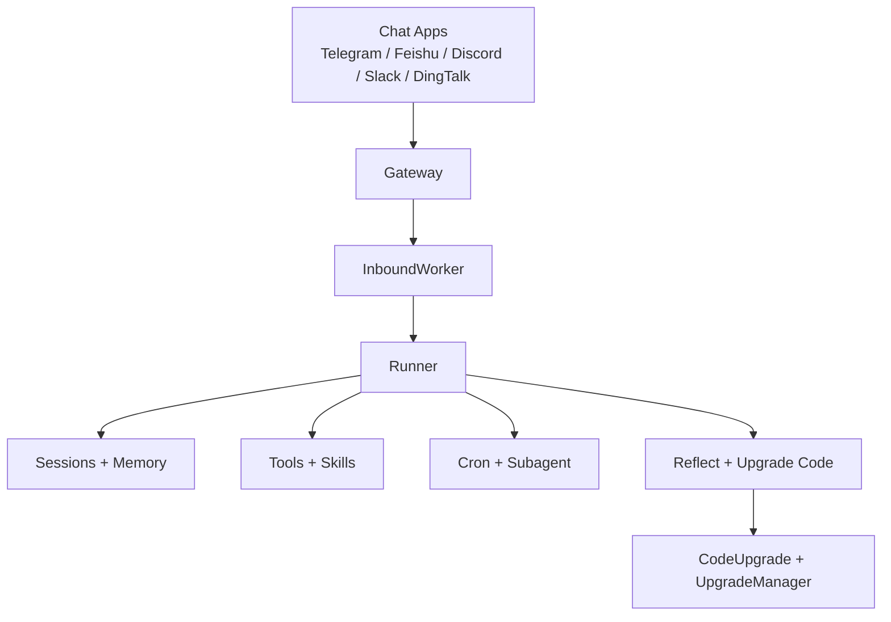
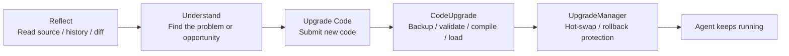
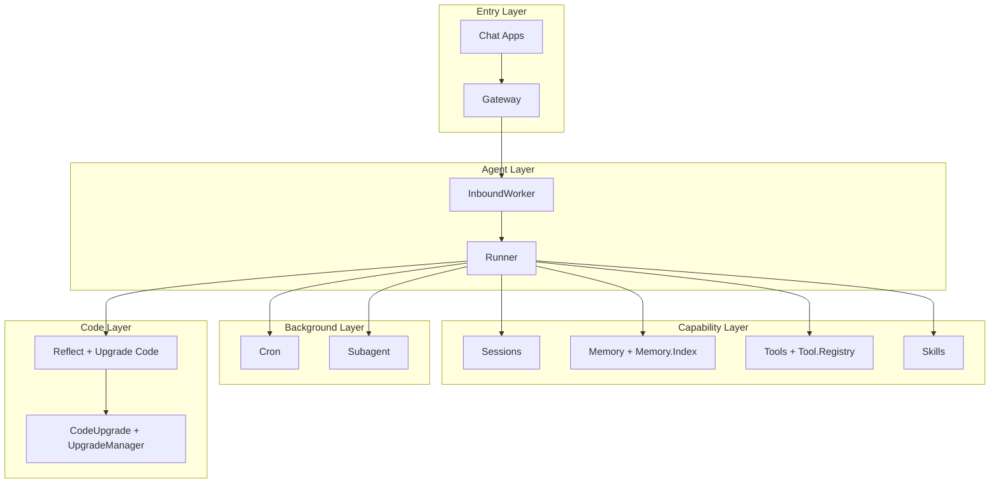

<div align="center">
  <h1>NexAgent</h1>
  <p><strong>Votre agent IA auto-évolutif</strong></p>
  <p>Un agent longue durée qui fonctionne dans les applications de chat que vous utilisez déjà, appelle des outils, mémorise le contexte et continue de s'améliorer grâce à une utilisation réelle.</p>
  <p><a href="./README.md">English README</a> | <a href="./README.zh-CN.md">中文文档</a> | <a href="./README.ja.md">日本語</a> | <a href="./README.ko.md">한국어</a></p>
</div>

**NexAgent** est un agent IA conçu pour une utilisation réelle et à long terme.

Ce n'est pas simplement une démo CLI ponctuelle, ni une fine couche de prompt autour d'un modèle. NexAgent est construit autour d'un objectif plus précis : maintenir un agent en ligne, le placer dans les applications de chat que vous utilisez déjà, lui donner de la mémoire et des outils, lui permettre de gérer des tâches en arrière-plan, et le rendre capable de s'améliorer au fil du temps.

Deux idées définissent le projet aujourd'hui :

- **Auto-évolution** : pas seulement l'ingénierie de prompt, mais aussi la mémoire, les compétences, les outils et l'auto-amélioration au niveau du code source.
- **Elixir/OTP** : arbres de supervision, GenServers, isolation des processus et chargement à chaud de code pour la tolérance aux pannes, la concurrence et le fonctionnement à long terme.

## At a Glance

Si vous ne retenez que trois choses à propos de NexAgent :

- **Ce que c'est** : un agent IA longue durée qui vit dans des applications de chat
- **Ce qu'il peut faire** : mémoire, outils, compétences, tâches planifiées et travaux en arrière-plan
- **Pourquoi il peut continuer à fonctionner** : Elixir/OTP avec des chemins d'auto-évolution intégrés



## What You Can Build

| Cas d'usage | Ce que fait NexAgent |
| --- | --- |
| Assistant toujours actif | Reste dans vos applications de chat et conserve le contexte de chaque conversation |
| Agent de connaissance personnel | Combine mémoire à long terme, historique et recherche |
| Assistant d'automatisation | Utilise cron pour les rappels, les tâches récurrentes et le travail en arrière-plan |
| Agent en croissance | S'étend via les compétences, les outils et l'auto-amélioration au niveau du code |

## Key Features

| Capacité | Ce que cela signifie |
| --- | --- |
| **Auto-évolution par conception** | `soul_update`, `memory_write`, `skill_capture`, `tool_create`, `reflect` et `upgrade_code` empêchent l'agent de rester statique |
| **Sessions longue durée** | Les sessions sont délimitées par `channel:chat_id` et conservent mémoire, historique et isolation |
| **Fonctionne dans vos applications de chat** | Telegram, Feishu, Discord, Slack et DingTalk sont déjà pris en charge |
| **Outils, compétences et mémoire intégrés** | Accès aux fichiers, shell, web, messagerie, recherche mémoire, planification et compétences inclus |
| **Travail en arrière-plan inclus** | Les tâches Cron et les sous-agents font partie intégrante du système |
| **Construit sur Elixir/OTP** | Arbres de supervision, processus de service et rechargement à chaud pour une disponibilité en production |

## Why NexAgent

De nombreux projets d'agents excellent dans l'exécution d'une tâche unique. NexAgent se concentre sur un ensemble différent de questions : une fois qu'un agent est réellement déployé dans des environnements de chat et maintenu en ligne, comment organiser les sessions, la mémoire, les tâches, la gestion des pannes et l'auto-amélioration ?

### Pourquoi auto-évolutif

NexAgent ne se différencie pas par « un outil de plus » ou « un modèle de plus ». Sa véritable différence est que l'évolution est traitée comme une capacité fondamentale du système.

Ce chemin est organisé en couches :

- `SOUL.md` : ajuster le comportement, le ton et les valeurs
- `MEMORY.md` / `HISTORY.md` / journaux quotidiens : accumuler l'expérience à long terme
- Compétences : transformer les nouvelles capacités en blocs de construction réutilisables
- Outils : étendre ce que l'agent peut réellement faire
- Code : utiliser `reflect` et `upgrade_code` pour inspecter et modifier l'agent lui-même

Voilà pourquoi « auto-évolutif » n'est pas qu'un slogan ici. C'est une direction qui va du prompt et de la mémoire jusqu'au code source.

### Pourquoi Elixir/OTP

Si un agent ne s'exécute qu'occasionnellement, le runtime importe peu. S'il doit rester en ligne, gérer plusieurs surfaces de chat, exécuter des travaux en arrière-plan, se remettre des pannes et éventuellement se mettre à jour à chaud, OTP cesse d'être un détail d'implémentation et devient une partie du produit.

NexAgent suit déjà ce chemin dans le code :

- `Application` gère l'infrastructure, les workers et les cycles de vie des canaux via un arbre de supervision
- `Gateway` gère les connexions aux applications de chat
- `InboundWorker` consomme les messages entrants et achemine les sessions
- `SessionManager`, `Tool.Registry`, `Cron` et `Subagent` fonctionnent comme des services longue durée
- `CodeUpgrade` et `UpgradeManager` gèrent les mises à jour à chaud, le versionnage et les chemins de retour arrière

C'est pourquoi Elixir/OTP n'est pas un détail anecdotique dans ce projet. C'est l'une des principales raisons pour lesquelles le projet existe sous cette forme.

## What Makes It Different

NexAgent n'essaie pas de résoudre « comment wrapper un appel de modèle de plus ». Il essaie de résoudre un ensemble de problèmes plus opérationnels :

| Prototype d'agent traditionnel | Ce que NexAgent vise |
| --- | --- |
| Tâches ponctuelles dans un CLI | Agents longue durée dans les applications de chat |
| Dépend principalement de la fenêtre de contexte actuelle | Sessions, mémoire, historique et recherche |
| Les nouvelles capacités viennent principalement des modifications de prompt | Outils, compétences et auto-amélioration au niveau du code |
| Les échecs tendent à tuer tout le tour | La supervision OTP et les services longue durée maintiennent la stabilité |
| Les capacités sont généralement fixes après le déploiement | L'agent continue d'évoluer pendant son fonctionnement |

## Install

### À partir des sources

Prérequis :

- Elixir `~> 1.18`
- Erlang/OTP

Installer les dépendances :

```bash
git clone https://github.com/gofenix/nex-agent.git
cd nex-agent
mix deps.get
```

## Quick Start

### 1. Initialisation

```bash
mix nex.agent onboard
```

Vous pouvez également pointer le CLI vers une instance spécifique :

```bash
mix nex.agent -c /path/to/config.json -w /path/to/workspace onboard
```

Lors de la première exécution, NexAgent crée la configuration et l'espace de travail pour cette instance :

```text
~/.nex/agent/
├── config.json
├── tools/
└── workspace/
    ├── AGENTS.md
    ├── SOUL.md
    ├── USER.md
    ├── skills/
    ├── sessions/
    └── memory/
        ├── MEMORY.md
        ├── HISTORY.md
        └── YYYY-MM-DD/log.md
```

### 2. Configuration du modèle

La méthode la plus directe consiste à définir le fournisseur, le modèle et la clé API via le CLI :

```bash
mix nex.agent config set provider openai
mix nex.agent config set model gpt-4o
mix nex.agent config set api_key openai sk-xxx
```

Si vous souhaitez utiliser Ollama :

```bash
mix nex.agent config set provider ollama
mix nex.agent config set model llama3.1
```

Fournisseurs par défaut :

- `anthropic`
- `openai`
- `openrouter`
- `ollama`

L'accès aux fournisseurs est unifié via `req_llm`, donc NexAgent n'a plus besoin d'un module client écrit séparément pour chaque fournisseur.

Emplacement du fichier de configuration :

```text
~/.nex/agent/config.json
```

Si vous passez `--config` sans définir `defaults.workspace`, l'espace de travail par défaut est `Path.dirname(config.json)/workspace` pour cette instance.

### 3. Chat

Le CLI est un shell hôte pour le runtime de l'agent. Les actions spécifiques aux capacités restent dans la boucle de l'agent via les outils et les compétences ; le CLI lui-même ne gère que les sessions et l'état du runtime.

Message unique :

```bash
mix nex.agent -m "hello"
```

Mode interactif :

```bash
mix nex.agent
```

### 4. Lancer la passerelle

```bash
mix nex.agent gateway
```

Vérifier le statut :

```bash
mix nex.agent status
```

Cibler une instance spécifique :

```bash
mix nex.agent -c /path/to/config.json status
mix nex.agent -c /path/to/config.json -w /path/to/workspace gateway
```

Arrêter la passerelle :

```bash
mix nex.agent gateway stop
```

## Chat Apps

NexAgent n'est pas conçu pour vivre uniquement dans un terminal.

L'objectif est de placer l'agent dans les applications de chat que vous utilisez déjà, afin qu'il fasse partie de la communication et des flux de travail réels.

Canaux actuellement pris en charge dans le code :

| Canal | Ce dont vous avez besoin |
| --- | --- |
| Telegram | Jeton de bot |
| Feishu | App ID + App Secret |
| Discord | Jeton de bot |
| Slack | Jeton de bot + jeton au niveau application |
| DingTalk | App Key + App Secret |

### Telegram

Telegram est le moyen le plus simple de commencer.

1. Créez un bot via `@BotFather`
2. Configurez Telegram dans `config.json` ou via le CLI
3. Lancez la passerelle

Exemple :

```bash
mix nex.agent config set telegram.enabled true
mix nex.agent config set telegram.token 123456:ABCDEF
mix nex.agent config set telegram.allow_from 10001,10002
mix nex.agent config set telegram.reply_to_message true
mix nex.agent gateway
```

Les autres applications de chat sont mieux configurées directement dans `~/.nex/agent/config.json`.

### Feishu et Lark CLI

Feishu est toujours pris en charge en tant que canal de chat.

Ce qui a changé, c'est la surface d'automatisation de l'espace de travail :

- NexAgent n'inclut plus d'outils métier `feishu_*` intégrés pour Docs, Sheets, Base, Calendar, Tasks, Drive, l'administration du chat ou la recherche.
- Pour ces opérations, utilisez l'outil `bash` existant avec `lark-cli` externe.
- `lark-cli` n'est pas vendu ni auto-installé par NexAgent. Installez-le séparément depuis [larksuite/cli](https://github.com/larksuite/cli).
- Si `lark-cli` est manquant, l'erreur shell doit être affichée directement, suivie d'une indication d'installation.

## Models

NexAgent prend actuellement en charge :

- Anthropic
- OpenAI
- OpenRouter
- Ollama

Les points de départ les plus simples sont généralement :

- Modèle cloud : OpenAI ou OpenRouter
- Modèle local : Ollama

`Runner` gère la boucle de l'agent et dispatch vers l'implémentation du fournisseur sélectionné.

## Tools and Skills

### Outils intégrés

Outils intégrés par défaut :

- `read`
- `write`
- `edit`
- `list_dir`
- `bash`
- `web_search`
- `web_fetch`
- `message`
- `memory_write`
- `cron`
- `spawn_task`
- `skill_discover`
- `skill_get`
- `skill_capture`
- `skill_import`
- `skill_sync`
- `tool_list`
- `tool_create`
- `tool_delete`
- `soul_update`
- `reflect`
- `upgrade_code`

Ensemble, ils couvrent les fichiers, les commandes shell, l'accès web, la messagerie sortante, la mémoire à long terme, la planification, la croissance des compétences, la croissance des outils et les mises à niveau de code.

### Outils globaux personnalisés

Les outils Elixir personnalisés résident dans `~/.nex/agent/workspace/tools/<name>/` et sont enregistrés comme des outils de première classe.

- `tool_create` crée un outil personnalisé dans l'espace de travail
- `tool_list` inspecte les outils intégrés et personnalisés
- `tool_delete` supprime un outil personnalisé

### Compétences

Au-delà des outils, NexAgent dispose d'un système de compétences basé sur Markdown.

Les compétences sont des modules de workflow réutilisables qui aident l'agent à :

- empaqueter des workflows
- standardiser des tâches récurrentes
- créer des instructions réutilisables pour lui-même

Les paquets de compétences runtime locaux à l'instance résident dans `workspace/skills/<name>/`. Découvrez-les via `skill_discover`, inspectez-les via `skill_get`, et capturez de nouveaux paquets de connaissances locales via `skill_capture`.

Les politiques de workflow appartenant au dépôt peuvent également résider dans `.nex/skills/<name>/SKILL.md`. Lorsque `skill_runtime.enabled` est activé, les compétences Markdown locales au dépôt sont migrées vers des paquets gérés par le runtime sous `workspace/skills/rt__*`.

Les capacités basées sur le code appartiennent au système d'outils, où les modules Elixir implémentent un comportement déterministe via `Tool.Behaviour`.

### Tests E2E SkillRuntime

- La couverture E2E hermétique s'exécute via `Runner.run/3`, des espaces de travail temporaires, un `Tool.Registry` réel, des appels LLM simulés et des réponses GitHub simulées. Ces tests sont inclus dans le chemin `mix test` par défaut et sont étiquetés `:e2e`.
- La couverture E2E en direct est étiquetée `:live_e2e` et est exclue des séries de test par défaut. Utilisez `mix test --only live_e2e` lorsque `OPENAI_API_KEY` est défini. Le chemin d'importation en direct GitHub nécessite également `GH_TOKEN` ou `GITHUB_TOKEN`.
- Le fichier de test en direct GitHub par défaut pointe vers le dépôt en cours de test via `SKILL_RUNTIME_LIVE_REPO`, `SKILL_RUNTIME_LIVE_COMMIT_SHA` et `SKILL_RUNTIME_LIVE_PATH`. Dans GitHub Actions, les valeurs par défaut sont `${GITHUB_REPOSITORY}`, `${GITHUB_SHA}` et `test/support/fixtures/skill_runtime/live_packages/live_echo_playbook`.
- Le CI par défaut exécute la suite hermétique via `mix test`. Les tests E2E en direct ne s'exécutent que dans le workflow manuel/quotidien dédié.

## Memory and Sessions

Les sessions NexAgent ne sont pas de simples fenêtres de contexte éphémères. Ce sont des conversations persistantes avec des couches de mémoire en arrière-plan.

### Sessions

Les sessions sont délimitées par `channel:chat_id`, par exemple :

- `telegram:123456`
- `discord:channel_id`

Cela maintient l'isolation des différentes surfaces de chat au lieu de tout mélanger dans un seul flux de conversation.

Des commandes de contrôle de base existent déjà :

- `/new` : démarrer une nouvelle session
- `/stop` : arrêter les tâches actives de la session en cours

### Memory

Le système de mémoire est organisé en couches :

- `MEMORY.md` : mémoire à long terme
- `HISTORY.md` : historique consultable
- Journal quotidien `YYYY-MM-DD/log.md` : mémoire opérationnelle et expérience accumulée
- `Memory.Index` : recherche de type BM25

Le but de cette conception est simple :

- l'agent ne doit pas repartir de zéro à chaque fois
- tout ne doit pas être poussé dans le prompt
- la mémoire à long terme, l'historique et l'expérience quotidienne doivent jouer des rôles différents

## Six-Layer Growth

C'est l'une des capacités déterminantes de NexAgent.

Son évolution ne se produit pas à un seul point. Elle se produit en six couches.

- `SOUL` : qui est l'agent et quels principes à long terme il suit
- `USER` : qui est l'utilisateur et comment l'agent doit collaborer avec lui
- `MEMORY` : faits durables sur l'environnement, le projet et le contexte opérationnel
- `SKILL` : workflows réutilisables et connaissances procédurales
- `TOOL` : capacités exécutables déterministes
- `CODE` : mises à niveau de l'implémentation interne

### Soul

`SOUL.md` ajuste le comportement, la personnalité et les valeurs.

### User

`USER.md` capture qui est l'utilisateur, comment il préfère collaborer et ce qui doit rester stable entre les sessions.

### Memory

Via `MEMORY.md`, `HISTORY.md` et les journaux quotidiens, l'agent peut continuer à accumuler des faits durables sur le projet et l'environnement au lieu de dépendre uniquement de la fenêtre de chat actuelle.

### Skills

Via `skill_capture`, l'agent peut continuer à étendre les workflows réutilisables et les connaissances procédurales. La découverte est unifiée via `skill_discover` et `skill_get`, tandis que les compétences de type paquet fiables peuvent être importées et actualisées via `skill_import` et `skill_sync`.

### Tools

Via `tool_create` et les outils personnalisés de l'espace de travail, l'agent peut continuer à étendre ses capacités exécutables déterministes.

### Code evolution

La couche code a son propre chemin de mise à niveau explicite :

- `reflect` : inspecter le code source du module, l'historique et les différences
- `upgrade_code` : soumettre le code de module mis à jour
- `CodeUpgrade` : sauvegarder, valider, compiler, charger et versionner le code
- `UpgradeManager` : coordonner les mises à niveau de code, les échanges à chaud et les chemins de retour arrière

C'est ce qui rend NexAgent plus qu'un agent configurable. C'est un système d'agent explicitement conçu pour apprendre, s'étendre et se mettre à niveau à travers plusieurs couches.



## Automation

### Cron

NexAgent inclut un outil `cron` intégré pour les tâches planifiées.

Opérations prises en charge :

- ajouter des tâches
- lister les tâches
- activer / désactiver des tâches
- déclencher des tâches manuellement
- inspecter le statut des tâches

Modes de planification pris en charge :

- `every_seconds`
- `cron_expr`
- `at`

Pour réduire les coûts d'exécution à long terme, l'exécution cron est délibérément allégée :

- portée d'outil réduite
- moins d'historique
- chargement de compétences ignoré dans les exécutions légères
- isolation de la session principale de l'utilisateur

### Subagent

`spawn_task` crée un sous-agent d'arrière-plan pour une tâche indépendante.

Il convient aux cas comme :

- travaux de longue durée
- sous-problèmes parallélisables
- tâches d'arrière-plan qui ne doivent pas bloquer la session principale

Lorsqu'il se termine, le résultat est renvoyé via le bus.

## Architecture

NexAgent n'est pas une collection informe de scripts. C'est un système en couches, conçu pour une exécution à long terme.



Une autre façon de lire le système :

- **Couche d'entrée** : Chat Apps + Gateway
- **Couche agent** : InboundWorker + Runner
- **Couche de capacités** : Tools + Skills + Memory + Sessions
- **Couche d'arrière-plan** : Cron + Subagent
- **Modèle de croissance en six couches** : Soul + User + Memory + Skill + Tool + Code

Rôles principaux dans le code :

- `Gateway` : gérer les processus de connexion aux applications de chat
- `InboundWorker` : router les messages entrants
- `Runner` : construire le contexte et exécuter la boucle de l'agent
- `SessionManager` : gérer les sessions persistées
- `Memory` / `Memory.Index` : gérer la mémoire à long terme et la recherche
- `Tool.Registry` : gérer les outils dynamiquement
- `Skills` : charger et exécuter les compétences
- `Cron` : gérer les tâches planifiées
- `Subagent` : gérer les sous-agents d'arrière-plan
- `CodeUpgrade` / `UpgradeManager` : gérer les mises à niveau de code au niveau source

Ces parties sont maintenues ensemble par un arbre de supervision OTP plutôt que d'être dispersées dans des scripts sans rapport.

## Security

NexAgent a déjà des limites importantes en place :

- l'accès aux fichiers est restreint aux racines autorisées
- le traversement de chemin est validé
- l'exécution shell dispose d'une liste blanche et d'un blocage de motifs dangereux
- les applications de chat prennent en charge `allow_from`
- l'exécution cron et sous-agent utilise des chemins plus restreints

Ce n'est pas terminé, mais la direction est claire : il n'est pas destiné à devenir un agent local sans restriction par défaut.

## Closing

Si vous deviez résumer le projet en une ligne :

> NexAgent est un agent IA auto-évolutif construit sur Elixir/OTP pour une utilisation réelle et à long terme.

Son facteur de différenciation n'est pas simplement « un fournisseur de plus » ou « quelques outils supplémentaires ». C'est la tentative de combiner tout cela dans un seul système :

- fonctionnement à long terme
- présence dans les applications de chat
- sessions et mémoire persistantes
- outils et compétences extensibles
- tâches planifiées et sous-agents d'arrière-plan
- auto-amélioration au niveau du code source
- tolérance aux pannes et mises à jour à chaud basées sur OTP

Si vous vous souciez de la façon dont les agents peuvent continuer à exister dans des environnements réels, et pas seulement accomplir une tâche de démonstration unique, c'est la voie que NexAgent ouvre.
