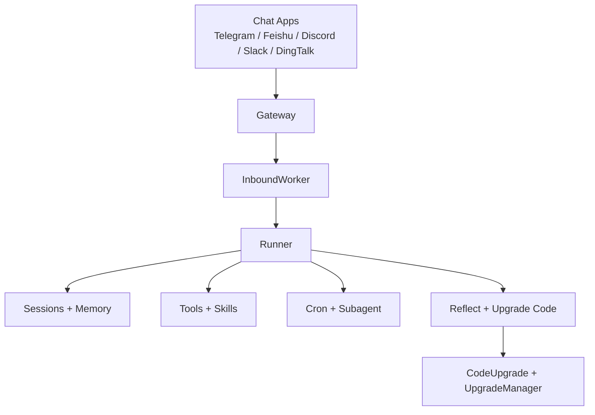
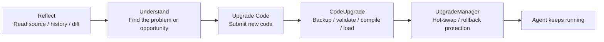
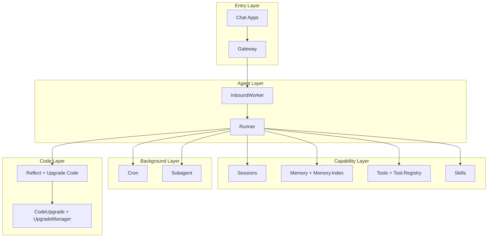

<div align="center">
  <h1>NexAgent</h1>
  <p><strong>自己進化する AI エージェント</strong></p>
  <p>使い慣れたチャットアプリの中で動作し、ツールを呼び出し、コンテキストを記憶し、実際の使用を通じて進化し続ける長期稼働エージェントです。</p>
  <p><a href="./README.md">English README</a> | <a href="./README.zh-CN.md">中文文档</a></p>
</div>

NexAgent は、実際の使用シーンに向けて構築された AI エージェントです。

単発の CLI デモではなく、モデルの単なるプロンプトラッパーでもありません。NexAgent はより明確な目標を持っています：エージェントを常時オンラインにし、使い慣れたチャットアプリの中に配置し、記憶とツールを与え、バックグラウンド作業を管理させ、時間の経過とともに改善できるようにすることです。

このプロジェクトを定義する 2 つの核心理念：

- **自己進化**：プロンプトエンジニアリングだけでなく、記憶、スキル、ツール、そしてソースコードレベルの自己改善
- **Elixir/OTP**：監督ツリー、GenServer、プロセス分離、ホットコードローディングによる耐障害性、並行処理、長期運用

## At a Glance

NexAgent について覚えておくべき 3 つのポイント：

- **何か**：チャットアプリ内で動作する長期稼働 AI エージェント
- **何ができるか**：記憶、ツール、スキル、スケジュールジョブ、バックグラウンドタスク
- **なぜ稼働し続けられるか**：Elixir/OTP ＋ 自己進化パス



## What You Can Build

| ユースケース | NexAgent の動作 |
| --- | --- |
| 常時稼働アシスタント | チャットアプリ内で常に稼働し、チャットごとのコンテキストを維持 |
| パーソナルナレッジエージェント | 長期記憶、履歴、検索を組み合わせる |
| 自動化アシスタント | cron によるリマインダー、定期ジョブ、バックグラウンド作業 |
| 成長するエージェント | スキル、ツール、コードレベルの自己改善を通じて拡張 |

## Key Features

| 機能 | 説明 |
| --- | --- |
| **設計による自己進化** | `soul_update`、`memory_write`、`skill_capture`、`tool_create`、`reflect`、`upgrade_code` によりエージェントは静的になりません |
| **長期稼働セッション** | セッションは `channel:chat_id` でスコープされ、記憶、履歴、分離を維持 |
| **チャットアプリで動作** | Telegram、Feishu、Discord、Slack、DingTalk に対応 |
| **ツール、スキル、記憶を内蔵** | ファイルアクセス、シェル、Web、メッセージング、記憶検索、スケジューリング、スキルが標準装備 |
| **バックグラウンド作業も標準** | Cron ジョブとサブエージェントがシステムの一部として組み込まれています |
| **Elixir/OTP ベース** | 監督ツリー、サービスプロセス、ホットリロードで実運用の稼働時間をサポート |

## Why NexAgent

多くのエージェントプロジェクトは単一タスクの完了に優れています。NexAgent は別の問いに焦点を当てています：エージェントが実際にチャット環境にデプロイされ、常時オンラインになったとき、セッション、記憶、ジョブ、障害処理、自己改善をどのように構成すべきか。

### 自己進化する理由

NexAgent の差別化要因は「もう一つのツール」や「もう一つのモデル」ではありません。本当の違いは、進化をコアシステム機能として扱っていることです。

そのパスは階層化されています：

- `SOUL.md`：行動、トーン、価値観を調整
- `MEMORY.md` / `HISTORY.md` / 日次ログ：長期経験を蓄積
- スキル：新しい能力を再利用可能なビルディングブロックに変換
- ツール：エージェントが実際にできることを拡張
- コード：`reflect` と `upgrade_code` を使用してエージェント自身を検査・変更

「自己進化」は単なるスローガンではありません。プロンプトと記憶からソースコードに至るまで、全ての方向に及ぶ指針です。

### Elixir/OTP を選ぶ理由

エージェントがたまにしか動作しないのであれば、ランタイムはそれほど重要ではありません。しかし、常時オンラインを維持し、複数のチャットサーフェスを管理し、バックグラウンド作業を実行し、障害から回復し、最終的に自身をホットアップグレードする必要がある場合、OTP は実装の詳細ではなく、プロダクトの一部になります。

NexAgent はすでにコード上でこのパスを実践しています：

- `Application` が監督ツリーを通じてインフラ、ワーカー、チャネルのライフサイクルを管理
- `Gateway` がチャットアプリの接続を管理
- `InboundWorker` がインバウンドメッセージを消費し、セッションをルーティング
- `SessionManager`、`Tool.Registry`、`Cron`、`Subagent` が長期稼働サービスとして動作
- `CodeUpgrade` と `UpgradeManager` がホットアップデート、バージョン管理、ロールバックパスを処理

これが Elixir/OTP がこのプロジェクトの背景情報ではなく、このプロジェクトがこの形で存在する主要な理由の一つである理由です。

## What Makes It Different

NexAgent は「もう一つのモデル呼び出しをラップする方法」を解決しようとしているのではありません。より運用上の問題を解決しようとしています：

| 従来のエージェントプロトタイプ | NexAgent が目指すもの |
| --- | --- |
| CLI での単発タスク | チャットアプリ内の長期稼働エージェント |
| 主に現在のコンテキストウィンドウに依存 | セッション、記憶、履歴、検索 |
| 新機能は主にプロンプト編集 | ツール、スキル、コードレベルの自己改善 |
| 障害はターン全体を中断しがち | OTP 監督と長期稼働サービスでシステム安定性を維持 |
| 機能はデプロイ後ほぼ固定 | 稼働中もエージェントは進化し続ける |

## Install

### ソースから

必要条件：

- Elixir `~> 1.18`
- Erlang/OTP

依存関係のインストール：

```bash
git clone https://github.com/gofenix/nex-agent.git
cd nex-agent
mix deps.get
```

## Quick Start

### 1. 初期化

```bash
mix nex.agent onboard
```

特定のインスタンスを指定することもできます：

```bash
mix nex.agent -c /path/to/config.json -w /path/to/workspace onboard
```

初回実行時に NexAgent は設定とワークスペースを作成します：

```text
~/.nex/agent/
├── config.json
├── tools/
└── workspace/
    ├── AGENTS.md
    ├── SOUL.md
    ├── USER.md
    ├── skills/
    ├── sessions/
    └── memory/
        ├── MEMORY.md
        ├── HISTORY.md
        └── YYYY-MM-DD/log.md
```

### 2. モデルの設定

最も直接的な方法は CLI を使用して provider、model、API key を設定することです：

```bash
mix nex.agent config set provider openai
mix nex.agent config set model gpt-4o
mix nex.agent config set api_key openai sk-xxx
```

Ollama を使用する場合：

```bash
mix nex.agent config set provider ollama
mix nex.agent config set model llama3.1
```

デフォルトのプロバイダー：

- `anthropic`
- `openai`
- `openrouter`
- `ollama`

プロバイダーアクセスは `req_llm` を通じて統一されているため、プロバイダーごとに個別のクライアントモジュールは不要です。

設定ファイルの場所：

```text
~/.nex/agent/config.json
```

`--config` を指定し `defaults.workspace` を設定しない場合、ワークスペースのデフォルトは `config.json` のあるディレクトリの `workspace/` になります。

### 3. チャット

CLI はエージェントランタイムのホストシェルです。具体的な機能はエージェントループがツールとスキルを通じてセッション内で処理します。

単発メッセージ：

```bash
mix nex.agent -m "hello"
```

対話モード：

```bash
mix nex.agent
```

### 4. ゲートウェイの起動

```bash
mix nex.agent gateway
```

ステータス確認：

```bash
mix nex.agent status
```

特定のインスタンスを指定：

```bash
mix nex.agent -c /path/to/config.json status
mix nex.agent -c /path/to/config.json -w /path/to/workspace gateway
```

ゲートウェイの停止：

```bash
mix nex.agent gateway stop
```

## Chat Apps

NexAgent はターミナルだけで動作することを想定していません。

目標は、使い慣れたチャットアプリの中にエージェントを配置し、実際のコミュニケーションとワークフローの一部にすることです。

コード上ですでに対応しているチャネル：

| チャネル | 必要なもの |
| --- | --- |
| Telegram | Bot Token |
| Feishu | App ID + App Secret |
| Discord | Bot Token |
| Slack | Bot Token + App-Level Token |
| DingTalk | App Key + App Secret |

### Telegram

Telegram は最も始めやすいチャネルです。

1. `@BotFather` でボットを作成
2. `config.json` または CLI で Telegram を設定
3. ゲートウェイを起動

例：

```bash
mix nex.agent config set telegram.enabled true
mix nex.agent config set telegram.token 123456:ABCDEF
mix nex.agent config set telegram.allow_from 10001,10002
mix nex.agent config set telegram.reply_to_message true
mix nex.agent gateway
```

その他のチャットアプリは `~/.nex/agent/config.json` を直接編集して設定することをお勧めします。

### Feishu と Lark CLI

Feishu はチャットチャネルとして引き続きサポートされています。

変更されたのはワークスペース自動化の部分です：

- NexAgent は Docs、Sheets、Base、Calendar、Tasks、Drive、チャット管理、検索用の `feishu_*` ビジネスツールを内蔵しなくなりました。
- これらの操作には、既存の `bash` ツールから外部の `lark-cli` を呼び出してください。
- `lark-cli` は NexAgent にバンドルまたは自動インストールされません。[larksuite/cli](https://github.com/larksuite/cli) から個別にインストールしてください。
- `lark-cli` がない場合、シェルエラーをそのまま表示し、インストールのヒントを提示します。

## Models

NexAgent は現在以下のプロバイダーをサポートしています：

- Anthropic
- OpenAI
- OpenRouter
- Ollama

最もシンプルな開始点：

- クラウドモデル：OpenAI または OpenRouter
- ローカルモデル：Ollama

`Runner` がエージェントループを処理し、選択されたプロバイダーの実装にディスパッチします。

## Tools and Skills

### 組み込みツール

デフォルトの組み込みツール：

- `read`
- `write`
- `edit`
- `list_dir`
- `bash`
- `web_search`
- `web_fetch`
- `message`
- `memory_write`
- `cron`
- `spawn_task`
- `skill_discover`
- `skill_get`
- `skill_capture`
- `skill_import`
- `skill_sync`
- `tool_list`
- `tool_create`
- `tool_delete`
- `soul_update`
- `reflect`
- `upgrade_code`

これらでファイル、シェルコマンド、Web アクセス、アウトバウンドメッセージング、長期記憶、スケジューリング、スキル成長、ツール成長、コードアップグレードをカバーします。

### カスタムグローバルツール

カスタム Elixir ツールは `~/.nex/agent/workspace/tools/<name>/` に配置され、第一級ツールとして登録されます。

- `tool_create` はワークスペースカスタムツールを作成
- `tool_list` は組み込みツールとカスタムツールを表示
- `tool_delete` はカスタムツールを削除

### スキル

ツールに加えて、NexAgent には Markdown ベースのスキルシステムがあります。

スキルはエージェントが以下のことを行うための再利用可能なワークフローモジュールです：

- ワークフローのパッケージ化
- 繰り返しタスクの標準化
- 自身のための再利用可能な指示を作成

インスタンスローカルのランタイムスキルパッケージは `workspace/skills/<name>/` にあります。`skill_discover` で発見し、`skill_get` で調査し、`skill_capture` で新しいローカルナレッジパッケージを取り込みます。

リポジトリ所有のワークフローポリシーは `.nex/skills/<name>/SKILL.md` にも配置できます。`skill_runtime.enabled` が有効な場合、リポジトリローカルの Markdown スキルは `workspace/skills/rt__*` にマイグレーションされ、ランタイムによって管理されます。

コードベースの機能はツールシステムに属し、Elixir モジュールが `Tool.Behaviour` を通じて決定論的な動作を実装します。

### SkillRuntime E2E テスト

- Hemetic E2E は `Runner.run/3`、一時ワークスペース、実際の `Tool.Registry`、スタブ LLM、スタブ GitHub レスポンスを通じてパス全体をカバーします。これらのテストはデフォルトの `mix test` に含まれ、`:e2e` タグが付いています。
- Live E2E には `:live_e2e` タグが付いており、デフォルトのテスト実行からは除外されています。`OPENAI_API_KEY` が設定されている場合は `mix test --only live_e2e` で実行できます。GitHub のライブインポートパスには `GH_TOKEN` または `GITHUB_TOKEN` も必要です。
- ライブ GitHub フィクスチャはデフォルトで `SKILL_RUNTIME_LIVE_REPO`、`SKILL_RUNTIME_LIVE_COMMIT_SHA`、`SKILL_RUNTIME_LIVE_PATH` を介してテスト対象のリポジトリを指します。GitHub Actions ではデフォルトで `${GITHUB_REPOSITORY}`、`${GITHUB_SHA}`、`test/support/fixtures/skill_runtime/live_packages/live_echo_playbook` になります。
- デフォルトの CI は `mix test` で Hemetic スイートを実行します。Live E2E は専用の手動/ナイトリー CI ワークフローでのみ実行されます。

## Memory and Sessions

NexAgent のセッションは単なる短命なコンテキストウィンドウではありません。背後にメモリレイヤーを持つ永続的な会話です。

### Sessions

セッションは `channel:chat_id` でスコープされます。例：

- `telegram:123456`
- `discord:channel_id`

これにより、異なるチャットサーフェスが分離され、すべてがひとつの会話ストリームに混ざることがありません。

基本的な制御コマンド：

- `/new`：新しいセッションを開始
- `/stop`：現在のセッションのアクティブなタスクを停止

### Memory

メモリシステムは階層化されています：

- `MEMORY.md`：長期記憶
- `HISTORY.md`：検索可能な履歴
- 日次 `YYYY-MM-DD/log.md`：運用記憶と蓄積された経験
- `Memory.Index`：BM25 スタイルの検索

この設計のポイントはシンプルです：

- エージェントが毎回ゼロから始める必要はない
- すべてをプロンプトに詰め込むべきではない
- 長期記憶、履歴、日々の経験がそれぞれ異なる役割を果たす

## Six-Layer Growth

これは NexAgent の最も特徴的な能力の一つです。

進化は単一のポイントで起こるのではなく、6 つの階層で行われます。

- `SOUL`：エージェントのアイデンティティと長期的な行動原則
- `USER`：ユーザーのプロファイルとコラボレーションの好み
- `MEMORY`：環境、プロジェクト、運用コンテキストに関する永続的な事実
- `SKILL`：再利用可能なワークフローと手続き的知識
- `TOOL`：決定論的な実行可能能力
- `CODE`：内部実装のアップグレード

### Soul

`SOUL.md` は行動、性格、価値観を調整します。

### User

`USER.md` はユーザーが誰であるか、どのようなコラボレーションを好むか、セッション間で安定させるべき情報を保持します。

### Memory

`MEMORY.md`、`HISTORY.md`、日次ログを通じて、エージェントは現在のチャットウィンドウだけに依存せず、耐久性のあるプロジェクトや環境の事実を蓄積し続けることができます。

### Skills

`skill_capture` を通じて、エージェントは再利用可能なワークフローと手続き的知識を拡張し続けることができます。発見は `skill_discover` と `skill_get` で統一され、信頼できるパッケージスタイルのスキルは `skill_import` と `skill_sync` でインポートおよび更新できます。

### Tools

`tool_create` とワークスペースカスタムツールを通じて、エージェントは決定論的な実行可能能力を拡張し続けることができます。

### Code evolution

コードレイヤーには独自の明示的なアップグレードパスがあります：

- `reflect`：モジュールのソース、履歴、差分を検査
- `upgrade_code`：更新されたモジュールコードを送信
- `CodeUpgrade`：バックアップ、検証、コンパイル、ロード、バージョン管理
- `UpgradeManager`：コードアップグレード、ホットスワップ、ロールバックパスを調整

これにより、NexAgent は単なる設定可能なエージェント以上のものになっています。明示的に学習、拡張、複数の階層で自身をアップグレードするように構築されたエージェントシステムです。



## Automation

### Cron

NexAgent にはスケジュールジョブ用の組み込み `cron` ツールが含まれています。

サポートされている操作：

- ジョブの追加
- ジョブの一覧表示
- ジョブの有効化 / 無効化
- ジョブの手動トリガー
- ジョブステータスの確認

サポートされているスケジュールモード：

- `every_seconds`
- `cron_expr`
- `at`

長期稼働コストを削減するため、cron 実行は意図的に軽量化されています：

- ツール範囲の制限
- 履歴の削減
- 軽量実行ではスキル読み込みをスキップ
- ユーザーのメインセッションからの分離

### Subagent

`spawn_task` は独立したタスク用のバックグラウンドサブエージェントを作成します。

以下のようなケースに適しています：

- 長時間実行作業
- 並列化可能なサブ問題
- メインセッションをブロックすべきでないバックグラウンドタスク

完了すると、結果はバスを通じて送り返されます。

## Architecture

NexAgent はスクリプトの寄せ集めではありません。階層化された長期稼働システムです。



別の見方：

- **エントリーレイヤー**：Chat Apps + Gateway
- **エージェントレイヤー**：InboundWorker + Runner
- **ケイパビリティレイヤー**：Tools + Skills + Memory + Sessions
- **バックグラウンドレイヤー**：Cron + Subagent
- **6 層成長モデル**：Soul + User + Memory + Skill + Tool + Code

コード上の主要な役割：

- `Gateway`：チャットアプリ接続プロセスの管理
- `InboundWorker`：インバウンドメッセージのルーティング
- `Runner`：コンテキスト構築とエージェントループの実行
- `SessionManager`：永続化セッションの管理
- `Memory` / `Memory.Index`：長期記憶と検索の管理
- `Tool.Registry`：ツールの動的管理
- `Skills`：スキルの読み込みと実行
- `Cron`：スケジュールジョブの管理
- `Subagent`：バックグラウンドサブエージェントの管理
- `CodeUpgrade` / `UpgradeManager`：ソースレベルコードアップグレードの管理

これらのコンポーネントは OTP 監督ツリーによって統合され、無関係なスクリプトに分散することはありません。

## Security

NexAgent はすでにいくつかの重要な境界を設定しています：

- ファイルアクセスは許可されたルートに制限
- パストラバーサルは検証
- シェル実行にはホワイトリストと危険パターンブロッキング
- チャットアプリは `allow_from` をサポート
- cron とサブエージェントの実行はより制限されたパスを使用

まだ完成ではありませんが、方向性は明確です：デフォルトで無制限のローカル権限エージェントになることを意図していません。

## Closing

プロジェクトを一文にまとめると：

> NexAgent は、Elixir/OTP 上に構築された、長期稼働・実運用向けの自己進化型 AI エージェントです。

差別化要因は「もう一つのプロバイダー」や「あといくつかのツール」だけではありません。以下のすべてをひとつのシステムに組み合わせようとしている点にあります：

- 長期稼働
- チャットアプリへの常駐
- 永続的なセッションと記憶
- 拡張可能なツールとスキル
- スケジュールジョブとバックグラウンドサブエージェント
- ソースコードレベルの自己改善
- OTP による耐障害性とホットアップグレード

実際の環境でエージェントがどのように存在し続けるかに関心があるなら、それが NexAgent が推し進めている道です。
