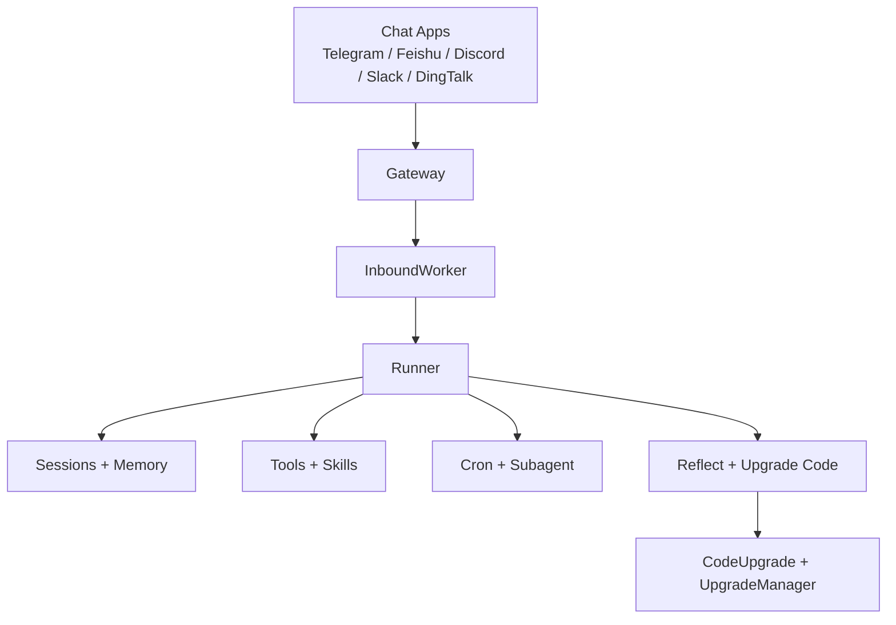
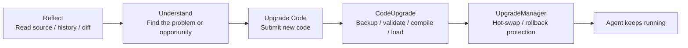
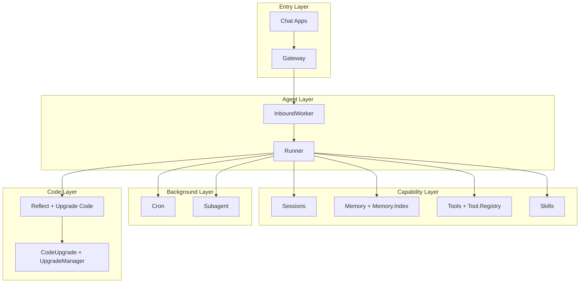

<div align="center">
  <h1>NexAgent</h1>
  <p><strong>스스로 진화하는 AI 에이전트</strong></p>
  <p>이미 사용 중인 채팅 앱에서 작동하며, 도구를 호출하고, 컨텍스트를 기억하고, 실제 사용을 통해 계속해서 발전하는 장기 실행 에이전트입니다.</p>
  <p><a href="./README.md">English README</a> | <a href="./README.zh-CN.md">中文文档</a> | <a href="./README.ja.md">日本語</a></p>
</div>

**NexAgent**는 실제 장기 실행 환경을 위해 구축된 AI 에이전트입니다.

일회성 CLI 데모나 단순한 프롬프트 래퍼가 아닙니다. NexAgent는 더 구체적인 목표를 가지고 있습니다: 에이전트를 항상 온라인 상태로 유지하고, 이미 사용 중인 채팅 앱 안에 배치하며, 메모리와 도구를 제공하고, 백그라운드 작업을 관리하게 하며, 시간이 지남에 따라 개선될 수 있도록 하는 것입니다.

이 프로젝트를 정의하는 두 가지 핵심 개념:

- **자기 진화**: 프롬프트 엔지니어링뿐만 아니라 메모리, 스킬, 도구, 소스 코드 수준의 자기 개선
- **Elixir/OTP**: 감독 트리, GenServer, 프로세스 격리, 핫 코드 로딩을 통한 내결함성, 동시성, 장기 운영

## At a Glance

NexAgent에 대해 꼭 기억해야 할 세 가지:

- **무엇인가**: 채팅 앱 안에서 작동하는 장기 실행 AI 에이전트
- **무엇을 할 수 있는가**: 메모리, 도구, 스킬, 예약 작업, 백그라운드 태스크
- **왜 계속 실행될 수 있는가**: Elixir/OTP + 내장 자기 진화 경로



## What You Can Build

| 사용 사례 | NexAgent의 역할 |
| --- | --- |
| 상시 대기 어시스턴트 | 채팅 앱에 항상 대기하며 채팅별 컨텍스트 유지 |
| 개인 지식 에이전트 | 장기 메모리, 기록, 검색 결합 |
| 자동화 어시스턴트 | cron을 사용한 알림, 정기 작업, 백그라운드 작업 |
| 성장하는 에이전트 | 스킬, 도구, 코드 수준 자기 개선을 통해 확장 |

## Key Features

| 기능 | 설명 |
| --- | --- |
| **설계에 의한 자기 진화** | `soul_update`, `memory_write`, `skill_capture`, `tool_create`, `reflect`, `upgrade_code`로 에이전트가 정체되지 않음 |
| **장기 실행 세션** | 세션은 `channel:chat_id`로 범위가 지정되며 메모리, 기록, 격리 유지 |
| **채팅 앱에서 작동** | Telegram, Feishu, Discord, Slack, DingTalk 지원 |
| **내장 도구, 스킬, 메모리** | 파일 접근, 셸, 웹, 메시징, 메모리 검색, 스케줄링, 스킬 기본 탑재 |
| **백그라운드 작업 포함** | Cron 작업과 서브에이전트가 시스템의 일부로 내장 |
| **Elixir/OTP 기반** | 감독 트리, 서비스 프로세스, 핫 리로드로 실제 운영 가동 시간 지원 |

## Why NexAgent

많은 에이전트 프로젝트는 단일 작업을 완료하는 데 능숙합니다. NexAgent는 다른 질문에 집중합니다: 에이전트가 실제로 채팅 환경에 배포되어 항상 온라인 상태가 되면, 세션, 메모리, 작업, 장애 처리, 자기 개선을 어떻게 구성해야 할까요?

### 자기 진화를 선택한 이유

NexAgent의 차별점은 "또 하나의 도구"나 "또 하나의 모델"이 아닙니다. 진화를 핵심 시스템 기능으로 취급한다는 점이 진정한 차이입니다.

그 경로는 계층화되어 있습니다:

- `SOUL.md`: 행동, 어조, 가치관 조정
- `MEMORY.md` / `HISTORY.md` / 일일 로그: 장기 경험 축적
- 스킬: 새로운 능력을 재사용 가능한 빌딩 블록으로 전환
- 도구: 에이전트가 실제로 할 수 있는 일 확장
- 코드: `reflect`와 `upgrade_code`를 사용하여 에이전트 자체 검사 및 수정

이것이 "자기 진화"가 단순한 슬로건이 아닌 이유입니다. 프롬프트와 메모리에서 소스 코드까지 모든 방향으로 이어지는 지침입니다.

### Elixir/OTP를 선택한 이유

에이전트가 가끔만 실행된다면 런타임은 그다지 중요하지 않습니다. 하지만 항상 온라인 상태를 유지하고, 여러 채팅 서피스를 관리하고, 백그라운드 작업을 실행하고, 장애에서 복구하고, 결국 스스로 핫 업그레이드해야 한다면 OTP는 구현 세부 사항이 아니라 제품의 일부가 됩니다.

NexAgent는 이미 코드에서 이 경로를 따르고 있습니다:

- `Application`이 감독 트리를 통해 인프라, 워커, 채널 라이프사이클 관리
- `Gateway`가 채팅 앱 연결 관리
- `InboundWorker`가 인바운드 메시지 소비 및 세션 라우팅
- `SessionManager`, `Tool.Registry`, `Cron`, `Subagent`가 장기 실행 서비스로 작동
- `CodeUpgrade`와 `UpgradeManager`가 핫 업데이트, 버전 관리, 롤백 경로 처리

이것이 Elixir/OTP가 이 프로젝트의 배경 정보가 아니라, 이 프로젝트가 이런 형태로 존재하는 주요 이유 중 하나인 이유입니다.

## What Makes It Different

NexAgent는 "모델 호출을 하나 더 래핑하는 방법"을 해결하려는 것이 아닙니다. 더 운영적인 문제 세트를 해결하려고 합니다:

| 기존 에이전트 프로토타입 | NexAgent가 지향하는 것 |
| --- | --- |
| CLI에서의 일회성 작업 | 채팅 앱 안의 장기 실행 에이전트 |
| 주로 현재 컨텍스트 윈도우에 의존 | 세션, 메모리, 기록, 검색 |
| 새 기능은 주로 프롬프트 편집 | 도구, 스킬, 코드 수준 자기 개선 |
| 장애는 보통 전체 턴을 중단시킴 | OTP 감독과 장기 실행 서비스로 시스템 안정성 유지 |
| 기능은 배포 후 거의 고정됨 | 실행 중에도 에이전트가 계속 진화 |

## Install

### 소스에서 설치

요구 사항:

- Elixir `~> 1.18`
- Erlang/OTP

의존성 설치:

```bash
git clone https://github.com/gofenix/nex-agent.git
cd nex-agent
mix deps.get
```

## Quick Start

### 1. 초기화

```bash
mix nex.agent onboard
```

특정 인스턴스를 지정할 수도 있습니다:

```bash
mix nex.agent -c /path/to/config.json -w /path/to/workspace onboard
```

첫 실행 시 NexAgent가 해당 인스턴스의 설정과 워크스페이스를 생성합니다:

```text
~/.nex/agent/
├── config.json
├── tools/
└── workspace/
    ├── AGENTS.md
    ├── SOUL.md
    ├── USER.md
    ├── skills/
    ├── sessions/
    └── memory/
        ├── MEMORY.md
        ├── HISTORY.md
        └── YYYY-MM-DD/log.md
```

### 2. 모델 설정

가장 직접적인 방법은 CLI를 통해 provider, model, API key를 설정하는 것입니다:

```bash
mix nex.agent config set provider openai
mix nex.agent config set model gpt-4o
mix nex.agent config set api_key openai sk-xxx
```

Ollama를 사용하는 경우:

```bash
mix nex.agent config set provider ollama
mix nex.agent config set model llama3.1
```

기본 제공자:

- `anthropic`
- `openai`
- `openrouter`
- `ollama`

제공자 접근은 `req_llm`을 통해 통합되어 있으므로 제공자별로 별도의 클라이언트 모듈이 필요하지 않습니다.

설정 파일 위치:

```text
~/.nex/agent/config.json
```

`--config`를 전달하고 `defaults.workspace`를 설정하지 않은 경우, 워크스페이스는 기본적으로 `config.json`이 있는 디렉토리의 `workspace/`가 됩니다.

### 3. 채팅

CLI는 에이전트 런타임의 호스트 셸입니다. 구체적인 기능은 에이전트 루프가 도구와 스킬을 통해 세션 내에서 처리합니다.

단일 메시지:

```bash
mix nex.agent -m "hello"
```

대화형 모드:

```bash
mix nex.agent
```

### 4. 게이트웨이 실행

```bash
mix nex.agent gateway
```

상태 확인:

```bash
mix nex.agent status
```

특정 인스턴스 대상:

```bash
mix nex.agent -c /path/to/config.json status
mix nex.agent -c /path/to/config.json -w /path/to/workspace gateway
```

게이트웨이 중지:

```bash
mix nex.agent gateway stop
```

## Chat Apps

NexAgent는 터미널에서만 작동하도록 만들어지지 않았습니다.

목표는 이미 사용 중인 채팅 앱 안에 에이전트를 배치하여 실제 커뮤니케이션과 워크플로의 일부가 되는 것입니다.

현재 코드에서 지원되는 채널:

| 채널 | 필요한 것 |
| --- | --- |
| Telegram | 봇 토큰 |
| Feishu | App ID + App Secret |
| Discord | 봇 토큰 |
| Slack | 봇 토큰 + App-Level 토큰 |
| DingTalk | App Key + App Secret |

### Telegram

Telegram은 가장 시작하기 쉬운 채널입니다.

1. `@BotFather`를 통해 봇 생성
2. `config.json` 또는 CLI에서 Telegram 설정
3. 게이트웨이 시작

예시:

```bash
mix nex.agent config set telegram.enabled true
mix nex.agent config set telegram.token 123456:ABCDEF
mix nex.agent config set telegram.allow_from 10001,10002
mix nex.agent config set telegram.reply_to_message true
mix nex.agent gateway
```

다른 채팅 앱은 `~/.nex/agent/config.json`을 직접 편집하여 설정하는 것이 좋습니다.

### Feishu와 Lark CLI

Feishu는 여전히 채팅 채널로 지원됩니다.

변경된 것은 워크스페이스 자동화 부분입니다:

- NexAgent는 더 이상 Docs, Sheets, Base, Calendar, Tasks, Drive, 채팅 관리, 검색용 `feishu_*` 비즈니스 도구를 내장하지 않습니다.
- 이러한 작업에는 기존 `bash` 도구를 통해 외부 `lark-cli`를 사용하세요.
- `lark-cli`는 NexAgent에 번들로 포함되거나 자동 설치되지 않습니다. [larksuite/cli](https://github.com/larksuite/cli)에서 별도로 설치하세요.
- `lark-cli`가 없는 경우 셸 오류를 그대로 표시하고 설치 힌트를 제공합니다.

## Models

NexAgent는 현재 다음 제공자를 지원합니다:

- Anthropic
- OpenAI
- OpenRouter
- Ollama

가장 간단한 시작점:

- 클라우드 모델: OpenAI 또는 OpenRouter
- 로컬 모델: Ollama

`Runner`가 에이전트 루프를 처리하고 선택된 제공자 구현으로 디스패치합니다.

## Tools and Skills

### 내장 도구

기본 내장 도구:

- `read`
- `write`
- `edit`
- `list_dir`
- `bash`
- `web_search`
- `web_fetch`
- `message`
- `memory_write`
- `cron`
- `spawn_task`
- `skill_discover`
- `skill_get`
- `skill_capture`
- `skill_import`
- `skill_sync`
- `tool_list`
- `tool_create`
- `tool_delete`
- `soul_update`
- `reflect`
- `upgrade_code`

이 도구들은 파일, 셸 명령, 웹 접근, 아웃바운드 메시징, 장기 메모리, 스케줄링, 스킬 성장, 도구 성장, 코드 업그레이드를 포괄합니다.

### 사용자 정의 전역 도구

사용자 정의 Elixir 도구는 `~/.nex/agent/workspace/tools/<name>/`에 위치하며 일급 도구로 등록됩니다.

- `tool_create`는 워크스페이스 사용자 정의 도구 생성
- `tool_list`는 내장 및 사용자 정의 도구 조회
- `tool_delete`는 사용자 정의 도구 삭제

### 스킬

도구 외에도 NexAgent는 Markdown 기반 스킬 시스템을 갖추고 있습니다.

스킬은 에이전트가 다음을 수행할 수 있는 재사용 가능한 워크플로 모듈입니다:

- 워크플로 패키징
- 반복 작업 표준화
- 자신을 위한 재사용 가능한 지침 생성

인스턴스 로컬 런타임 스킬 패키지는 `workspace/skills/<name>/`에 있습니다. `skill_discover`로 발견하고, `skill_get`으로 조사하며, `skill_capture`로 새로운 로컬 지식 패키지를 캡처합니다.

저장소 소유 워크플로 정책은 `.nex/skills/<name>/SKILL.md`에도 배치할 수 있습니다. `skill_runtime.enabled`가 활성화되면 저장소 로컬 Markdown 스킬이 `workspace/skills/rt__*`로 마이그레이션되어 런타임이 관리합니다.

코드 기반 기능은 도구 시스템에 속하며, Elixir 모듈이 `Tool.Behaviour`를 통해 결정론적 동작을 구현합니다.

### SkillRuntime E2E 테스트

- Hermetic E2E는 `Runner.run/3`, 임시 워크스페이스, 실제 `Tool.Registry`, 스텁 LLM, 스텁 GitHub 응답을 통해 전체 경로를 커버합니다. 이 테스트는 기본 `mix test`에 포함되며 `:e2e` 태그가 지정됩니다.
- Live E2E는 `:live_e2e` 태그가 지정되며 기본 테스트 실행에서 제외됩니다. `OPENAI_API_KEY`가 설정된 경우 `mix test --only live_e2e`로 실행할 수 있습니다. GitHub 라이브 가져오기 경로에는 `GH_TOKEN` 또는 `GITHUB_TOKEN`도 필요합니다.
- 라이브 GitHub fixture는 기본적으로 `SKILL_RUNTIME_LIVE_REPO`, `SKILL_RUNTIME_LIVE_COMMIT_SHA`, `SKILL_RUNTIME_LIVE_PATH`를 통해 테스트 중인 저장소를 가리킵니다. GitHub Actions에서는 기본값이 `${GITHUB_REPOSITORY}`, `${GITHUB_SHA}`, `test/support/fixtures/skill_runtime/live_packages/live_echo_playbook`입니다.
- 기본 CI는 `mix test`로 Hermetic 스위트를 실행합니다. Live E2E는 전용 수동/야간 워크플로에서만 실행됩니다.

## Memory and Sessions

NexAgent 세션은 단기 컨텍스트 윈도우가 아닙니다. 뒤에 메모리 레이어가 있는 영구적인 대화입니다.

### Sessions

세션은 `channel:chat_id`로 범위가 지정됩니다. 예:

- `telegram:123456`
- `discord:channel_id`

이렇게 하면 다른 채팅 서피스가 분리되어 모든 것이 하나의 대화 스트림에 섞이지 않습니다.

기본 제어 명령:

- `/new`: 새 세션 시작
- `/stop`: 현재 세션의 활성 작업 중지

### Memory

메모리 시스템은 계층화되어 있습니다:

- `MEMORY.md`: 장기 메모리
- `HISTORY.md`: 검색 가능한 기록
- 일일 `YYYY-MM-DD/log.md`: 운영 메모리 및 축적된 경험
- `Memory.Index`: BM25 스타일 검색

이 설계의 요점은 간단합니다:

- 에이전트가 매번 처음부터 시작할 필요가 없음
- 모든 것을 프롬프트에 밀어넣지 않음
- 장기 메모리, 기록, 일일 경험이 각각 다른 역할을 수행

## Six-Layer Growth

이것은 NexAgent의 가장 특징적인 능력 중 하나입니다.

진화는 단일 지점에서 발생하지 않습니다. 6개 계층에서 발생합니다.

- `SOUL`: 에이전트의 정체성과 장기 행동 원칙
- `USER`: 사용자 프로필 및 협업 선호도
- `MEMORY`: 환경, 프로젝트, 운영 컨텍스트에 대한 내구성 있는 사실
- `SKILL`: 재사용 가능한 워크플로와 절차적 지식
- `TOOL`: 결정론적 실행 가능 능력
- `CODE`: 내부 구현 업그레이드

### Soul

`SOUL.md`는 행동, 성격, 가치관을 조정합니다.

### User

`USER.md`는 사용자가 누구인지, 어떻게 협업하기를 선호하는지, 세션 간에 안정적으로 유지해야 할 정보를 담습니다.

### Memory

`MEMORY.md`, `HISTORY.md`, 일일 로그를 통해 에이전트는 현재 채팅 창에만 의존하지 않고 내구성 있는 프로젝트 및 환경 사실을 계속 축적할 수 있습니다.

### Skills

`skill_capture`를 통해 에이전트는 재사용 가능한 워크플로와 절차적 지식을 계속 확장할 수 있습니다. 발견은 `skill_discover`와 `skill_get`을 통해 통일되며, 신뢰할 수 있는 패키지 스타일 스킬은 `skill_import`와 `skill_sync`를 통해 가져오고 업데이트할 수 있습니다.

### Tools

`tool_create`와 워크스페이스 사용자 정의 도구를 통해 에이전트는 결정론적 실행 가능 능력을 계속 확장할 수 있습니다.

### Code evolution

코드 계층에는 자체적인 명시적 업그레이드 경로가 있습니다:

- `reflect`: 모듈 소스, 기록, 차이점 검사
- `upgrade_code`: 업데이트된 모듈 코드 제출
- `CodeUpgrade`: 백업, 검증, 컴파일, 로드, 버전 관리
- `UpgradeManager`: 코드 업그레이드, 핫 스왑, 롤백 경로 조정

이것이 NexAgent를 단순한 설정 가능한 에이전트 이상으로 만듭니다. 명시적으로 학습, 확장, 여러 계층에서 스스로 업그레이드하도록 구축된 에이전트 시스템입니다.



## Automation

### Cron

NexAgent에는 예약 작업을 위한 내장 `cron` 도구가 포함되어 있습니다.

지원되는 작업:

- 작업 추가
- 작업 목록 보기
- 작업 활성화 / 비활성화
- 작업 수동 트리거
- 작업 상태 확인

지원되는 스케줄링 모드:

- `every_seconds`
- `cron_expr`
- `at`

장기 실행 비용을 줄이기 위해 cron 실행은 의도적으로 가볍게 설계되었습니다:

- 더 좁은 도구 범위
- 더 적은 기록
- 경량 실행에서는 스킬 로딩 생략
- 사용자의 메인 세션과 격리

### Subagent

`spawn_task`는 독립적인 작업을 위한 백그라운드 서브에이전트를 생성합니다.

다음과 같은 경우에 적합합니다:

- 장시간 실행 작업
- 병렬화 가능한 하위 문제
- 메인 세션을 차단하지 말아야 할 백그라운드 작업

완료되면 결과가 버스를 통해 다시 전송됩니다.

## Architecture

NexAgent는 스크립트의 느슨한 집합이 아닙니다. 계층화된 장기 실행 시스템입니다.



다른 관점:

- **진입 계층**: Chat Apps + Gateway
- **에이전트 계층**: InboundWorker + Runner
- **역량 계층**: Tools + Skills + Memory + Sessions
- **백그라운드 계층**: Cron + Subagent
- **6계층 성장 모델**: Soul + User + Memory + Skill + Tool + Code

코드상의 핵심 역할:

- `Gateway`: 채팅 앱 연결 프로세스 관리
- `InboundWorker`: 인바운드 메시지 라우팅
- `Runner`: 컨텍스트 구축 및 에이전트 루프 실행
- `SessionManager`: 영구 세션 관리
- `Memory` / `Memory.Index`: 장기 메모리 및 검색 관리
- `Tool.Registry`: 도구 동적 관리
- `Skills`: 스킬 로딩 및 실행
- `Cron`: 예약 작업 관리
- `Subagent`: 백그라운드 서브에이전트 관리
- `CodeUpgrade` / `UpgradeManager`: 소스 코드 업그레이드 관리

이러한 구성 요소는 OTP 감독 트리로 통합되어 있으며, 관련 없는 스크립트에 흩어져 있지 않습니다.

## Security

NexAgent는 이미 몇 가지 중요한 경계를 설정하고 있습니다:

- 파일 접근은 허용된 루트로 제한
- 경로 탐색은 검증
- 셸 실행에는 화이트리스트와 위험 패턴 차단
- 채팅 앱은 `allow_from` 지원
- cron과 서브에이전트 실행은 더 제한된 경로 사용

아직 완성되지 않았지만 방향은 명확합니다: 기본적으로 무제한 로컬 권한 에이전트가 되는 것을 의도하지 않습니다.

## Closing

프로젝트를 한 줄로 요약하면:

> NexAgent는 Elixir/OTP 기반으로 구축된, 장기 실행 및 실제 운영을 위한 자기 진화형 AI 에이전트입니다.

차별점은 "또 하나의 제공자"나 "몇 가지 더 많은 도구"만이 아닙니다. 다음 모든 것을 하나의 시스템에 결합하려는 시도입니다:

- 장기 실행 운영
- 채팅 앱 상주
- 영구 세션 및 메모리
- 확장 가능한 도구와 스킬
- 예약 작업 및 백그라운드 서브에이전트
- 소스 코드 수준의 자기 개선
- OTP 기반 내결함성 및 핫 업그레이드

에이전트가 실제 환경에서 어떻게 존재할 수 있는지에 관심이 있다면,それが NexAgent가 추진하는 길입니다.
