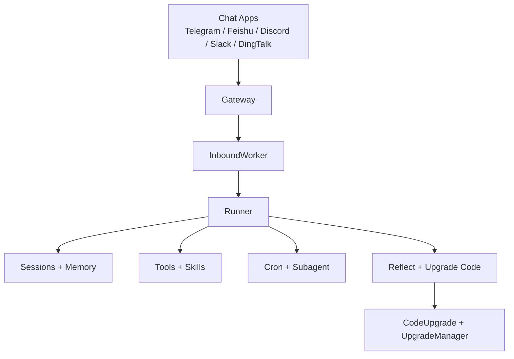
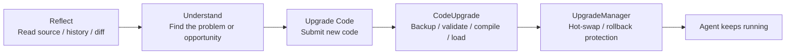
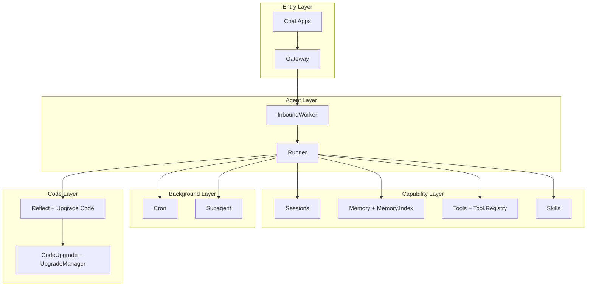

<div align="center">
  <h1>NexAgent</h1>
  <p><strong>Your own self-evolving AI agent</strong></p>
  <p>A long-running agent that works in the chat apps you already use, calls tools, remembers context, and keeps improving through real-world use.</p>
  <p><a href="./README.zh-CN.md">中文文档</a></p>
</div>

**NexAgent** is an AI agent built for real-world, long-running use.

It is not just a one-shot CLI demo, and it is not just a thin prompt wrapper around a model. NexAgent is built around a more specific goal: keep an agent online, place it inside the chat apps you already use, give it memory and tools, let it manage background work, and make it capable of improving over time.

Two ideas define the project today:

- **Self-evolution**: not only prompt engineering, but also memory, skills, tools, and source-level self-improvement.
- **Elixir/OTP**: supervision trees, GenServers, process isolation, and hot code loading for fault tolerance, concurrency, and long-lived operation.

## At a Glance

If you only remember three things about NexAgent, they should be:

- **What it is**: a long-running AI agent that lives in chat apps
- **What it can do**: memory, tools, skills, scheduled jobs, and background tasks
- **Why it can keep running**: Elixir/OTP plus built-in self-evolution paths



## What You Can Build

| Use case | What NexAgent is doing |
| --- | --- |
| Always-on assistant | Stays in your chat apps and keeps per-chat context over time |
| Personal knowledge agent | Combines long-term memory, history, and retrieval |
| Automation assistant | Uses cron for reminders, recurring jobs, and background work |
| A growing agent | Expands through skills, tools, and code-level self-improvement |

## Key Features

| Capability | What it means |
| --- | --- |
| **Self-evolving by design** | `soul_update`, `memory_write`, `skill_create`, `tool_create`, `reflect`, and `upgrade_code` keep the agent from staying static |
| **Long-running sessions** | Sessions are scoped by `channel:chat_id` and keep memory, history, and isolation |
| **Works in your chat apps** | Telegram, Feishu, Discord, Slack, and DingTalk are already supported |
| **Tools, skills, and memory built in** | File access, shell, web, messaging, memory search, scheduling, and skills come built in |
| **Background work included** | Cron jobs and subagents are part of the system, not an afterthought |
| **Built on Elixir/OTP** | Supervision trees, service processes, and hot reload support real-world uptime |

## Why NexAgent

Many agent projects are good at finishing a single task. NexAgent is focused on a different set of questions: once an agent is actually deployed into chat environments and kept online, how should sessions, memory, jobs, failure handling, and self-improvement be organized?

### Why self-evolving

NexAgent is not differentiated by “one more tool” or “one more model.” Its real difference is that evolution is treated as a core system capability.

That path is layered:

- `SOUL.md`: adjust behavior, tone, and values
- `MEMORY.md` / `HISTORY.md` / daily logs: accumulate long-term experience
- Skills: turn new abilities into reusable building blocks
- Tools: expand what the agent can actually do
- Code: use `reflect` and `upgrade_code` to inspect and modify the agent itself

That is why “self-evolving” is not just a slogan here. It is a direction that runs from prompt and memory all the way down to source code.

### Why Elixir/OTP

If an agent only runs once in a while, the runtime matters less. If it needs to stay online, manage multiple chat surfaces, run background work, recover from failures, and eventually hot-upgrade itself, OTP stops being an implementation detail and becomes part of the product.

NexAgent already follows that path in code:

- `Application` manages infrastructure, workers, and channel lifecycles through a supervision tree
- `Gateway` manages chat app connections
- `InboundWorker` consumes inbound messages and routes sessions
- `SessionManager`, `Tool.Registry`, `Cron`, and `Subagent` run as long-lived services
- `CodeUpgrade` and `UpgradeManager` handle hot updates, versioning, and rollback paths

That is why Elixir/OTP is not background trivia in this project. It is one of the main reasons the project exists in this form.

## What Makes It Different

NexAgent is not trying to solve “how do we wrap one more model call.” It is trying to solve a more operational set of problems:

| Traditional agent prototype | What NexAgent is aiming for |
| --- | --- |
| One-off tasks in a CLI | Long-lived agents inside chat apps |
| Mostly depends on the current context window | Sessions, memory, history, and retrieval |
| New capabilities mainly come from prompt edits | Tools, skills, and code-level self-improvement |
| Failures tend to kill the whole turn | OTP supervision and long-lived services keep the system stable |
| Capabilities are mostly fixed after deployment | The agent keeps evolving while it runs |

## Install

### From source

Requirements:

- Elixir `~> 1.18`
- Erlang/OTP

Install dependencies:

```bash
git clone https://github.com/gofenix/nex-agent.git
cd nex-agent
mix deps.get
```

## Quick Start

### 1. Initialize

```bash
mix nex.agent onboard
```

You can also point the CLI at a specific instance:

```bash
mix nex.agent -c /path/to/config.json -w /path/to/workspace onboard
```

On first run, NexAgent creates the config and workspace for that instance:

```text
~/.nex/agent/
├── config.json
├── tools/
└── workspace/
    ├── AGENTS.md
    ├── SOUL.md
    ├── USER.md
    ├── skills/
    ├── sessions/
    └── memory/
        ├── MEMORY.md
        ├── HISTORY.md
        └── YYYY-MM-DD/log.md
```

### 2. Configure your model

The most direct path is to set provider, model, and API key through the CLI:

```bash
mix nex.agent config set provider openai
mix nex.agent config set model gpt-4o
mix nex.agent config set api_key openai sk-xxx
```

If you want to use Ollama:

```bash
mix nex.agent config set provider ollama
mix nex.agent config set model llama3.1
```

Default providers:

- `anthropic`
- `openai`
- `openrouter`
- `ollama`

Provider access is unified through `req_llm`, so NexAgent no longer needs a
separate handwritten client module for each provider.

Config file location:

```text
~/.nex/agent/config.json
```

If you pass `--config` and do not set `defaults.workspace`, the workspace defaults to
`Path.dirname(config.json)/workspace` for that instance.

### 3. Chat

The CLI is a host shell for the agent runtime. Capability-specific actions stay inside the
agent loop through tools and skills; the CLI itself only manages sessions and runtime state.

Single message:

```bash
mix nex.agent -m "hello"
```

Interactive mode:

```bash
mix nex.agent
```

### 4. Run the gateway

```bash
mix nex.agent gateway
```

Check status:

```bash
mix nex.agent status
```

Target a specific instance:

```bash
mix nex.agent -c /path/to/config.json status
mix nex.agent -c /path/to/config.json -w /path/to/workspace gateway
```

Stop the gateway:

```bash
mix nex.agent gateway stop
```

## Chat Apps

NexAgent is not meant to live only in a terminal.

The goal is to place the agent inside the chat apps you already use, so it becomes part of real communication and workflows.

Currently supported in code:

| Channel | What you need |
| --- | --- |
| Telegram | Bot token |
| Feishu | App ID + App Secret |
| Discord | Bot token |
| Slack | Bot token + App-level token |
| DingTalk | App Key + App Secret |

### Telegram

Telegram is the easiest place to start.

1. Create a bot through `@BotFather`
2. Configure Telegram in `config.json` or through the CLI
3. Start the gateway

Example:

```bash
mix nex.agent config set telegram.enabled true
mix nex.agent config set telegram.token 123456:ABCDEF
mix nex.agent config set telegram.allow_from 10001,10002
mix nex.agent config set telegram.reply_to_message true
mix nex.agent gateway
```

Other chat apps are currently better configured directly in `~/.nex/agent/config.json`.

## Models

NexAgent currently supports:

- Anthropic
- OpenAI
- OpenRouter
- Ollama

The simplest starting points are usually:

- Cloud model: OpenAI or OpenRouter
- Local model: Ollama

`Runner` handles the agent loop and then dispatches to the selected provider implementation.

## Tools and Skills

### Built-in tools

Default built-in tools:

- `read`
- `write`
- `edit`
- `list_dir`
- `bash`
- `web_search`
- `web_fetch`
- `message`
- `memory_write`
- `cron`
- `spawn_task`
- `skill_list`
- `skill_create`
- `tool_list`
- `tool_create`
- `tool_delete`
- `soul_update`
- `reflect`
- `upgrade_code`

Together, these cover files, shell commands, web access, outbound messaging, long-term memory, scheduling, skill growth, tool growth, and code upgrades.

### Custom global tools

Custom Elixir tools live in `~/.nex/agent/workspace/tools/<name>/` and are registered as first-class tools.

- `tool_create` creates a workspace custom tool
- `tool_list` inspects built-in and custom tools
- `tool_delete` removes a custom tool

### Skills

Beyond tools, NexAgent has a Markdown-based skills system.

Skills are reusable workflow modules that help the agent:

- package workflows
- standardize recurring tasks
- create reusable instructions for itself

Instance-local skills live in `workspace/skills/<name>/SKILL.md` and are exposed to the model as `skill_<name>` tools.

Repository-owned workflow policy can also live in `.nex/skills/<name>/SKILL.md`.
Those repo-local skills are not part of the generic runtime defaults; they are the automation policy of the current repository.

Code-based capabilities belong in the tool system, where Elixir modules implement deterministic behavior through `Tool.Behaviour`.

### Repository Automation

NexAgent can also run a repository automation subsystem on top of the core runtime:

```bash
mix nex.agent orchestrator WORKFLOW.md
mix nex.agent orchestrator status WORKFLOW.md
```

This layer is intentionally separate from the core agent runtime.

- `Nex.Agent.*` remains the long-running runtime, session, memory, tool, and skill engine
- `WORKFLOW.md` defines how this repository wants issue-to-PR automation to behave
- `.nex/skills/*` can provide repository-owned execution policy for that workflow

That means a repository can use NexAgent without any orchestrator at all, or add repo-local automation policy without turning the runtime itself into a GitHub issue bot.

## Memory and Sessions

NexAgent sessions are not just short-lived context windows. They are persistent conversations with memory layers behind them.

### Sessions

Sessions are scoped by `channel:chat_id`, for example:

- `telegram:123456`
- `discord:channel_id`

This keeps different chat surfaces isolated instead of blending everything into one conversation stream.

Basic control commands already exist:

- `/new`: start a new session
- `/stop`: stop active tasks for the current session

### Memory

The memory system is layered:

- `MEMORY.md`: long-term memory
- `HISTORY.md`: searchable history
- daily `YYYY-MM-DD/log.md`: operational memory and accumulated experience
- `Memory.Index`: BM25-style retrieval

The point of this design is simple:

- the agent should not start from zero every time
- not everything should be pushed into the prompt
- long-term memory, history, and daily experience should play different roles

## Six-Layer Growth

This is one of the defining capabilities of NexAgent.

Its evolution does not happen at a single point. It happens in six layers.

- `SOUL`: who the agent is and which long-term principles it follows
- `USER`: who the user is and how the agent should collaborate with them
- `MEMORY`: durable facts about the environment, project, and operational context
- `SKILL`: reusable workflows and procedural knowledge
- `TOOL`: deterministic executable capabilities
- `CODE`: internal implementation upgrades

### Soul

`SOUL.md` adjusts behavior, personality, and values.

### User

`USER.md` captures who the user is, how they prefer to collaborate, and what should stay stable across sessions.

### Memory

Through `MEMORY.md`, `HISTORY.md`, and daily logs, the agent can keep accumulating durable project and environment facts instead of depending only on the current chat window.

### Skills

Through `skill_create`, the agent can keep expanding reusable workflows and procedural knowledge.

### Tools

Through `tool_create` and workspace custom tools, the agent can keep expanding deterministic executable capability.

### Code evolution

The code layer has its own explicit upgrade path:

- `reflect`: inspect module source, history, and diffs
- `upgrade_code`: submit updated module code
- `CodeUpgrade`: backup, validate, compile, load, and version code
- `UpgradeManager`: coordinate code upgrades, hot swaps, and rollback paths

That is what makes NexAgent more than a configurable agent. It is an agent system that is explicitly being built to learn, extend, and upgrade itself across multiple layers.



## Automation

### Cron

NexAgent includes a built-in `cron` tool for scheduled jobs.

Supported operations:

- add jobs
- list jobs
- enable / disable jobs
- trigger jobs manually
- inspect job status

Supported scheduling modes:

- `every_seconds`
- `cron_expr`
- `at`

To reduce long-running cost, cron execution is deliberately lighter:

- narrower tool scope
- less history
- skipped skill loading in lightweight runs
- isolation from the user’s main session

### Subagent

`spawn_task` creates a background subagent for an independent task.

It fits cases like:

- long-running work
- parallelizable subproblems
- background tasks that should not block the main session

When it finishes, the result is sent back through the bus.

## Architecture

NexAgent is not a loose collection of scripts. It is a layered, long-running system.



Another way to read the system is:

- **Entry layer**: Chat Apps + Gateway
- **Agent layer**: InboundWorker + Runner
- **Capability layer**: Tools + Skills + Memory + Sessions
- **Background layer**: Cron + Subagent
- **Automation layer**: Workflow + Tracker + Workspace isolation + Orchestrator, driven by repository-owned policy files like `WORKFLOW.md`
- **Six-layer growth model**: Soul + User + Memory + Skill + Tool + Code

Core roles in code:

- `Gateway`: manage chat app connection processes
- `InboundWorker`: route inbound messages
- `Runner`: build context and execute the agent loop
- `SessionManager`: manage persisted sessions
- `Memory` / `Memory.Index`: manage long-term memory and retrieval
- `Tool.Registry`: manage tools dynamically
- `Skills`: load and execute skills
- `Cron`: manage scheduled jobs
- `Subagent`: manage background subagents
- `Automation.Orchestrator`: manage repository issue polling and worker lifecycle
- `Automation.Workflow`: load repo automation configuration from `WORKFLOW.md`
- `Automation.WorkspaceManager`: isolate worktrees and agent workspaces per issue
- `CodeUpgrade` / `UpgradeManager`: manage source-level code upgrades

These parts are held together by an OTP supervision tree instead of being scattered across unrelated scripts.

## Security

NexAgent already has some important boundaries in place:

- file access is restricted to allowed roots
- path traversal is validated
- shell execution has a whitelist and dangerous-pattern blocking
- chat apps support `allow_from`
- cron and subagent execution use more restricted paths

It is not finished, but the direction is clear: this is not meant to become an unrestricted local god-agent by default.

## Closing

If you had to compress the project into one line:

> NexAgent is a self-evolving AI agent built on Elixir/OTP for long-running, real-world use.

Its differentiator is not just “one more provider” or “a few more tools.” It is the attempt to combine all of these in one system:

- long-running operation
- chat-app presence
- persistent sessions and memory
- extensible tools and skills
- scheduled jobs and background subagents
- source-level self-improvement
- OTP-driven fault tolerance and hot upgrades

If you care about how agents can keep existing in real environments, not just finish a single demo task, that is the path NexAgent is pushing forward.
