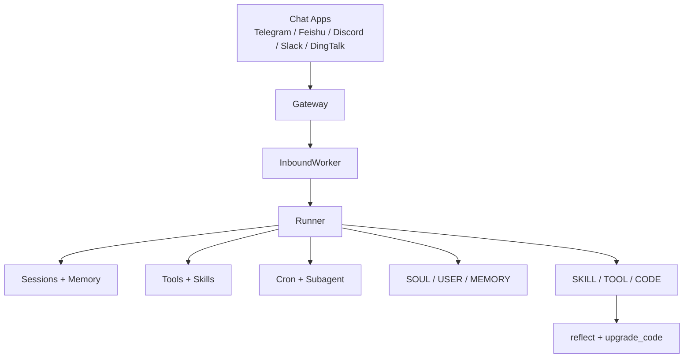
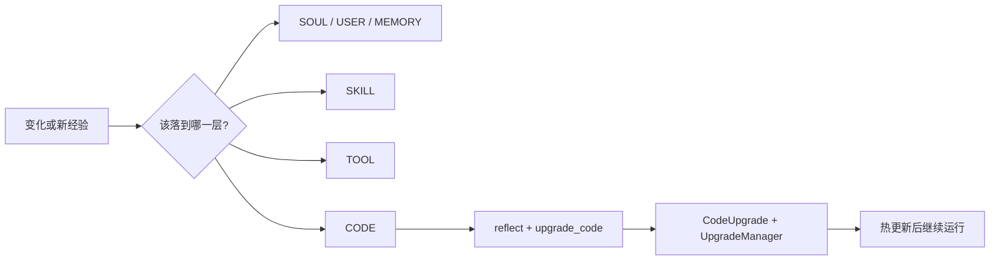
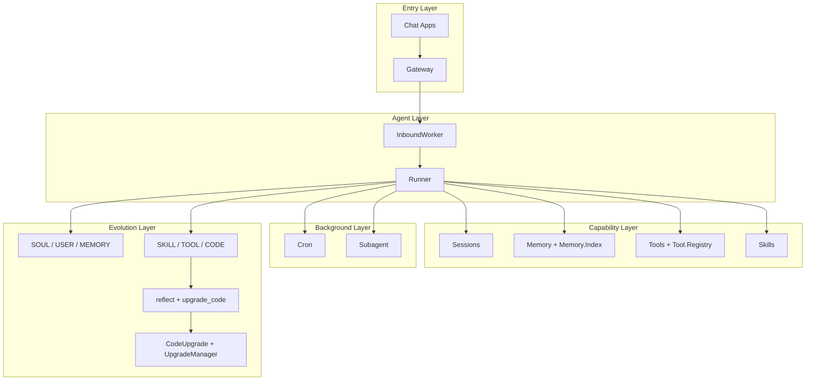

<div align="center">
  <h1>NexAgent</h1>
  <p><strong>持续进化的专属 AI Agent</strong></p>
  <p>它可以长期运行，在你常用的聊天应用中工作，调用工具，保留上下文记忆，并在真实使用中持续进化。</p>
  <p><a href="./README.md">English README</a></p>
</div>

NexAgent 是一个面向真实使用场景的 AI Agent。

它不是只在终端里跑一轮对话的脚本，也不只是给大模型包一层 prompt。NexAgent 的目标更明确一些: 让 Agent 长期在线、进入聊天应用、拥有记忆与工具、管理定时任务与后台工作，并且在真实使用中持续进化。

这个项目当前最重要的两条方向是:

- **自主进化**: 不只做 prompt engineering，也做 memory、skills、tools，以及 agent 自身代码的反思与进化。
- **Elixir/OTP**: 基于监督树、GenServer、进程隔离和热代码加载构建，强调容错、并发、长期运行与系统可靠性。

## At a Glance

如果只看一眼，NexAgent 可以理解成三层:

- **你看到的**: 一个长期在线、能在聊天应用里工作的 AI Agent
- **它会做的**: 记忆、工具调用、技能扩展、定时任务、后台子任务
- **它为什么能长期工作**: Elixir/OTP + 自我进化能力



## What You Can Build

| 场景 | NexAgent 在做什么 |
| --- | --- |
| 长期在线助手 | 持续待在聊天应用里，按会话保存上下文和历史 |
| 个人知识助手 | 把长期记忆、历史记录和检索结合在一起 |
| 自动化任务助手 | 通过 cron 管理定时提醒、周期任务和后台工作 |
| 可成长的 Agent | 通过 skills、tools 和代码级进化不断扩展能力 |

## Key Features

| 能力 | 说明 |
| --- | --- |
| **Self-evolving by design** | 通过 `soul_update`、`memory_write`、`skill_capture`、tools 和 `upgrade_code`，让 Agent 不停留在静态能力集 |
| **Long-running sessions** | 按 `channel:chat_id` 管理会话，支持长期记忆、历史沉淀与会话隔离 |
| **Works in your chat apps** | 当前支持 Telegram、Feishu、Discord、Slack、DingTalk |
| **Tools, skills, and memory built in** | 内置文件、Shell、Web、消息、记忆、定时任务、技能管理等能力 |
| **Background work included** | 支持 cron 定时任务和 subagent 子代理 |
| **Built on Elixir/OTP** | 通过监督树、服务进程和热更新机制支撑真实运行环境 |

## Why NexAgent

很多 Agent 项目擅长“完成一次任务”。NexAgent 更关心另一类问题: 当 Agent 真正进入聊天环境、开始长期运行之后，会话、记忆、任务、容错和进化该怎么组织。

### Why self-evolving

NexAgent 的差异不在“多一个工具”或“多一个模型”，而在它把进化能力做成了系统核心。

它的进化不是单点发生，而是按六层体系展开:

- `SOUL`: 我是谁，我长期按什么原则行动
- `USER`: 这个用户是谁，他希望我怎么与他协作
- `MEMORY`: 这个环境、项目、上下文里有哪些长期事实
- `SKILL`: 遇到这类问题时，下次应该按什么流程做
- `TOOL`: 我新增了什么可重复调用的确定性能力
- `CODE`: 我的内部实现逻辑本身发生了什么变化

这意味着 NexAgent 的“自进化”不是一句口号，而是从身份、用户模型、长期事实、可复用方法、能力扩展到源码升级的完整链路。

### Why Elixir/OTP

如果 Agent 只是偶尔跑一轮推理，语言和架构影响没那么大。但如果它要长期在线、管理多个聊天入口、做后台任务、在出错后恢复，并且还要热更新自己，OTP 的价值就会直接变成产品能力的一部分。

NexAgent 当前已经明确建立在这条路线之上:

- `Application` 监督树管理基础设施、worker 和 channel 生命周期
- `Gateway` 管理各个聊天应用的连接
- `InboundWorker` 消费入站消息并调度会话
- `SessionManager`、`Tool.Registry`、`Cron`、`Subagent` 作为长期服务进程存在
- `CodeUpgrade` 和 `UpgradeManager` 负责源码升级、热更新、版本保存与回滚

所以这个项目的技术选型不是背景信息，而是核心卖点之一。

## What Makes It Different

NexAgent 想解决的不是“怎么再包一层模型调用”，而是下面这组更接近真实运行的问题:

| 传统 Agent 原型 | NexAgent 想做的事 |
| --- | --- |
| 只在 CLI 里跑一轮任务 | 长期在线，进入聊天应用 |
| 主要依赖当前上下文窗口 | 有 sessions、memory、history 和检索 |
| 新能力主要靠改 prompt | 通过 tools、skills 和代码级进化扩展能力 |
| 出错后容易整轮中断 | 用 OTP 的监督树和服务进程维持系统稳定 |
| 部署后能力基本固定 | 允许运行中持续进化 |

## Install

### From source

环境要求:

- Elixir `~> 1.18`
- Erlang/OTP

安装依赖:

```bash
git clone https://github.com/gofenix/nex-agent.git
cd nex-agent
mix deps.get
```

## Quick Start

### 1. Initialize

```bash
mix nex.agent onboard
```

也可以显式指定某个实例的配置和工作区:

```bash
mix nex.agent -c /path/to/config.json -w /path/to/workspace onboard
```

首次运行会为该实例创建配置和工作区:

```text
~/.nex/agent/
├── config.json
├── tools/
└── workspace/
    ├── AGENTS.md
    ├── SOUL.md
    ├── USER.md
    ├── skills/
    ├── sessions/
    └── memory/
        ├── MEMORY.md
        ├── HISTORY.md
        └── YYYY-MM-DD/log.md
```

### 2. Configure your model

最直接的方式是用 CLI 设置 provider、model 和 API key:

```bash
mix nex.agent config set provider openai
mix nex.agent config set model gpt-4o
mix nex.agent config set api_key openai sk-xxx
```

如果你使用 Ollama:

```bash
mix nex.agent config set provider ollama
mix nex.agent config set model llama3.1
```

默认支持的 provider:

- `anthropic`
- `openai`
- `openrouter`
- `ollama`

底层 provider 接入已经统一收敛到 `req_llm`，不再需要为每个 provider
分别维护一套手写客户端实现。

配置文件位于:

```text
~/.nex/agent/config.json
```

如果传了 `--config` 但没有设置 `defaults.workspace`，该实例的工作区默认会落到
`config.json` 所在目录下的 `workspace/`。

### 3. Chat

CLI 是 agent runtime 的宿主壳，不是任务/知识/执行器的独立产品入口。具体能力仍由
agent loop 在会话中通过 tools 和 skills 自主调用。

单轮调用:

```bash
mix nex.agent -m "hello"
```

交互模式:

```bash
mix nex.agent
```

### 4. Run the gateway

```bash
mix nex.agent gateway
```

查看状态:

```bash
mix nex.agent status
```

指定实例运行:

```bash
mix nex.agent -c /path/to/config.json status
mix nex.agent -c /path/to/config.json -w /path/to/workspace gateway
```

停止网关:

```bash
mix nex.agent gateway stop
```

## Chat Apps

NexAgent 不应该只待在 CLI 里。

它的目标是运行在你已经使用的聊天应用中，让 Agent 真正进入日常沟通和工作流。

当前代码中已经支持:

| Channel | What you need |
| --- | --- |
| Telegram | Bot Token |
| Feishu | App ID + App Secret |
| Discord | Bot Token |
| Slack | Bot Token + App-Level Token |
| DingTalk | App Key + App Secret |

### Telegram

推荐从 Telegram 开始，接入路径最直接。

1. 使用 `@BotFather` 创建机器人并获得 token
2. 配置 `config.json` 或使用 CLI 设置 Telegram
3. 启动网关

示例:

```bash
mix nex.agent config set telegram.enabled true
mix nex.agent config set telegram.token 123456:ABCDEF
mix nex.agent config set telegram.allow_from 10001,10002
mix nex.agent config set telegram.reply_to_message true
mix nex.agent gateway
```

其他聊天应用当前更适合直接编辑 `~/.nex/agent/config.json` 完成配置。

## Models

NexAgent 当前支持以下 provider:

- Anthropic
- OpenAI
- OpenRouter
- Ollama

如果你想快速开始，最简单的路径通常是:

- 云端模型: OpenAI 或 OpenRouter
- 本地模型: Ollama

模型调用由 `Runner` 统一调度，再按 provider 适配到对应实现。

## Tools and Skills

### Built-in tools

当前默认内置工具包括:

- `read`
- `write`
- `edit`
- `list_dir`
- `bash`
- `web_search`
- `web_fetch`
- `message`
- `memory_write`
- `cron`
- `spawn_task`
- `skill_discover`
- `skill_get`
- `skill_capture`
- `skill_import`
- `skill_sync`
- `tool_list`
- `tool_create`
- `tool_delete`
- `soul_update`
- `reflect`
- `upgrade_code`

这套工具覆盖了文件操作、命令执行、外部信息获取、消息发送、`USER` / `MEMORY` 持久化、调度和六层进化。

### Custom global tools

自定义 Elixir tools 存放在 `~/.nex/agent/workspace/tools/<name>/`，会被注册成一等工具。

- `tool_create` 创建 workspace 级自定义 tool
- `tool_list` 查看内置和自定义 tools
- `tool_delete` 删除自定义 tool

说明:

- `USER` 与 `MEMORY` 已拆成独立工具：`user_update` 只写 `USER` 层，`memory_write` 只写 `MEMORY` 层
- `tool_list` 用 `layers` 字段暴露工具所属层级；例如 `user_update` 返回 `["user"]`，`memory_write` 返回 `["memory"]`

### Skills

除了工具，NexAgent 还有一套基于 Markdown 的技能系统。

技能的角色不是“再写一层 prompt”，而是把工作流沉淀成可复用模块。它可以用于:

- 封装工作流
- 标准化重复任务
- 让 Agent 自己创建可复用说明

运行时技能 package 位于 `workspace/skills/<name>/`。统一通过 `skill_discover` 发现，通过 `skill_get` 按 progressive disclosure 查看，并通过 `skill_capture` 沉淀新的本地知识 package。

仓库自己的协作约定也可以放在 `.nex/skills/<name>/SKILL.md` 里；当启用 `skill_runtime.enabled` 时，这些 repo-local markdown skills 会迁移到 `workspace/skills/rt__*`，再由运行时统一管理。

需要确定性代码能力时，应通过 tools 系统实现；Elixir 模块属于 tools，不属于 skills。

### SkillRuntime 端到端测试

- Hermetic E2E 会通过 `Runner.run/3`、临时 workspace、真实 `Tool.Registry`、stub LLM 和 stub GitHub 响应把整条链路跑通。这组测试会跟随默认 `mix test` 一起跑，并打上 `:e2e` 标签。
- Live E2E 打 `:live_e2e` 标签，默认不进入常规测试。手工运行用 `mix test --only live_e2e`；其中 OpenAI 需要 `OPENAI_API_KEY`，GitHub 导入链路还需要 `GH_TOKEN` 或 `GITHUB_TOKEN`。
- Live GitHub fixture 默认通过 `SKILL_RUNTIME_LIVE_REPO`、`SKILL_RUNTIME_LIVE_COMMIT_SHA` 和 `SKILL_RUNTIME_LIVE_PATH` 指向当前仓库；GitHub Actions 中默认会落到 `${GITHUB_REPOSITORY}`、`${GITHUB_SHA}` 和 `test/support/fixtures/skill_runtime/live_packages/live_echo_playbook`。
- 默认 CI 只跑 hermetic 套件；live E2E 只放在单独的手工/夜间 workflow 里。

## Memory and Sessions

NexAgent 的会话不是临时对话上下文，而是带有持久化和记忆层的长期会话。

### Sessions

会话按 `channel:chat_id` 维护，例如:

- `telegram:123456`
- `discord:channel_id`

这意味着不同聊天入口天然隔离，不会把所有上下文混成一团。

同时，当前也支持基础控制命令:

- `/new`: 开始新会话
- `/stop`: 停止当前会话的活动任务

### Memory

记忆系统分成几层:

- `MEMORY.md`: 长期记忆
- `HISTORY.md`: 历史记录
- 每日日志 `YYYY-MM-DD/log.md`: 运行过程中的经验记录
- `Memory.Index`: BM25 检索索引

这套设计的目标很直接:

- 不让 Agent 每次都从零开始
- 不把所有东西都堆进 prompt
- 让长期偏好、历史记录和运行日志各自承担不同职责

## Self-Evolution

这是 NexAgent 最核心的能力之一。

它的进化不是单点发生，而是按六层分流展开。

### 六层定义

#### 1. SOUL

`SOUL` 定义 agent 的身份、价值观和长期行为原则。

这一层回答的问题是:

- 我是谁
- 我长期按什么原则行动
- 我在协作中应保持什么风格和底线

`SOUL` 不承载具体任务经验，也不记录临时事实。它只保存长期稳定、会持续影响行为方式的高层原则。

#### 2. USER

`USER` 定义当前用户的长期画像。

这一层回答的问题是:

- 这个用户是谁
- 他偏好什么表达方式
- 他希望我如何与他协作
- 他的时区、语言、风格和长期要求是什么

`USER` 只保存与特定用户长期相关的信息，不保存项目事实，也不保存通用流程。

#### 3. MEMORY

`MEMORY` 定义环境、项目和上下文中的长期事实。

这一层回答的问题是:

- 这个项目有哪些约定
- 当前环境有哪些稳定事实
- 哪些经验值得长期保留
- 哪些背景信息以后还会反复用到

`MEMORY` 保存的是事实和长期上下文，而不是操作步骤。它适合记录项目约定、环境特征、关键背景和可复用经验结论。

#### 4. SKILL

`SKILL` 定义可重复使用的方法和流程。

这一层回答的问题是:

- 遇到这类问题时，下次应该怎么做
- 哪些步骤已经被验证有效
- 哪些工作流值得复用

`SKILL` 属于程序性记忆。它不是记录事实，而是沉淀流程、套路和多步骤方法。

#### 5. TOOL

`TOOL` 定义系统新增的确定性能力。

这一层回答的问题是:

- 我现在新增了什么可调用能力
- 哪些动作应该由程序稳定执行，而不是靠模型临时描述
- 哪些能力可以被明确复用为工具

`TOOL` 是能力扩展层。它把某类动作从文本方法升级成可执行能力。

#### 6. CODE

`CODE` 定义系统内部实现本身的变化。

这一层回答的问题是:

- 我的内部逻辑是否需要修改
- 某个核心模块是否需要升级
- 是否需要通过源码变更来修复问题或增强行为

`CODE` 是最底层、影响范围最大的进化层。只有当高层不能解决问题时，才应进入这一层。

### 分流原则

当系统学到一个新变化时，应优先落到最高且最轻的那一层，而不是直接修改更底层的实现。

默认顺序是:

1. 能进入 `USER` 或 `MEMORY`，就不要急着写 `SKILL`
2. 能进入 `SKILL`，就不要急着做 `TOOL`
3. 能做成 `TOOL`，就不要急着改 `CODE`

也就是说，应优先记住事实，再沉淀方法，再扩展能力，最后才修改系统内部实现。

### 运行时映射

当前实现与六层体系的对应关系如下:

- `SOUL`: `soul_update` + `SOUL.md`
- `USER`: `user_update` + `USER.md`
- `MEMORY`: `memory_write` + `MEMORY.md`
- `SKILL`: `skill_discover` / `skill_get` / `skill_capture` / `skill_import` / `skill_sync` + `skills/`
- `TOOL`: `tool_create` / `tool_list` / `tool_delete` + `tools/`
- `CODE`: `reflect` / `upgrade_code` / `CodeUpgrade` / `UpgradeManager`

这里有一个容易混淆的点:

- `USER` 和 `MEMORY` 在概念与工具上都是两层，不应合并
- `user_update` 只处理用户画像，`memory_write` 只处理长期环境/项目事实
- 因此 `tool_list` 会分别标注这两个工具的单层归属

### 关于 CODE 层

`CODE` 层处理的是 agent 自身实现的变化。

当问题已经不能通过调整 `SOUL`、补充 `USER` / `MEMORY`、沉淀 `SKILL` 或扩展 `TOOL` 来解决时，才需要进入这一层。此时 agent 会通过 `reflect` 查看模块源码、版本和差异，再通过 `upgrade_code` 提交新的模块实现，并由 `CodeUpgrade` 与 `UpgradeManager` 完成热更新、版本保存和回滚保护。



## Automation

### Cron

NexAgent 内置 `cron` 工具来管理计划任务。

支持的操作包括:

- 新增任务
- 列出任务
- 启用 / 禁用任务
- 手动触发任务
- 查看状态

支持的调度方式包括:

- `every_seconds`
- `cron_expr`
- `at`

为了降低长期运行成本，cron 的执行方式也做了专门优化:

- 限制工具范围
- 减少历史上下文
- 跳过部分技能与记忆整理
- 与用户主会话隔离

### Subagent

`spawn_task` 可以派生后台子代理来执行独立任务。

它适合:

- 耗时任务
- 可拆分的子问题
- 不希望阻塞主会话的工作

子代理执行完成后，会把结果通过总线回送给主流程。

## Architecture

NexAgent 的结构不是一组松散脚本，而是一个分层的长期系统。



如果换一种更接近系统分层的看法，可以把它理解成:

- **入口层**: Chat Apps + Gateway
- **Agent 层**: InboundWorker + Runner
- **能力层**: Tools + Skills + Memory + Sessions
- **后台层**: Cron + Subagent
- **进化层**: SOUL / USER / MEMORY / SKILL / TOOL / CODE

对应到代码中的核心角色:

- `Gateway`: 管理各个聊天应用的连接进程
- `InboundWorker`: 路由入站消息
- `Runner`: 构建上下文并执行 agent loop
- `SessionManager`: 管理持久化会话
- `Memory` / `Memory.Index`: 管理长期记忆与检索
- `Tool.Registry`: 动态管理工具
- `Skills`: 加载和执行技能
- `Cron`: 管理计划任务
- `Subagent`: 管理后台子代理
- `CodeUpgrade` / `UpgradeManager`: 管理源码升级

这些组件由 OTP 监督树统一组织，而不是散落成一组脚本。

## Security

NexAgent 当前已经实现了一些基础安全边界:

- 文件访问限制在允许根目录内
- 路径穿越会被校验
- Shell 命令有白名单与危险模式拦截
- 聊天应用支持 `allow_from`
- cron 和 subagent 使用受限执行路径

它还远没到终局，但方向是明确的: 不是一个默认无限权力的本地 agent。

## Closing

如果用一句话概括:

> NexAgent 是一个基于 Elixir/OTP 构建、可长期运行并持续进化的 AI Agent。

它真正的差异点，不是又支持了一个 provider，也不是单纯多了几个工具，而是试图把下面这些能力放进同一个系统里:

- 长期在线运行
- 出现在聊天应用里
- 持久化会话与记忆
- 可扩展的工具和技能
- 定时任务与后台子代理
- 六层分流的自我进化
- OTP 驱动的容错与热更新

如果你关心的是 Agent 如何在真实环境中长期存在，而不是只在 demo 中完成一次任务，NexAgent 走的就是这条路线。
