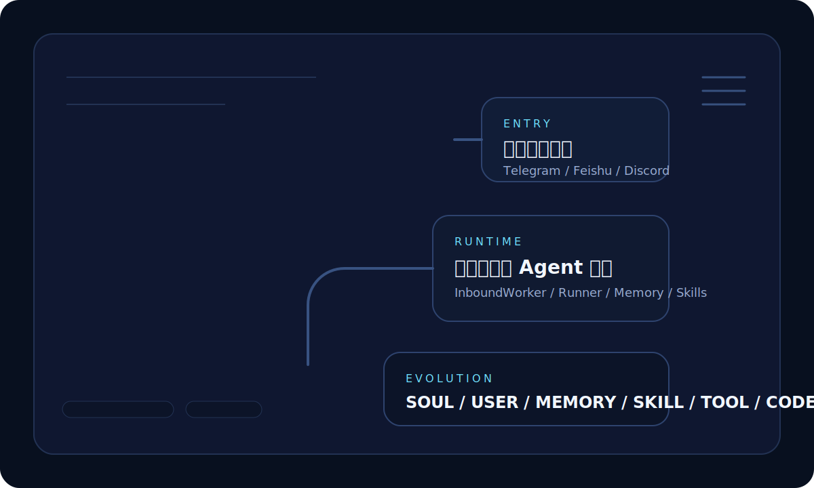
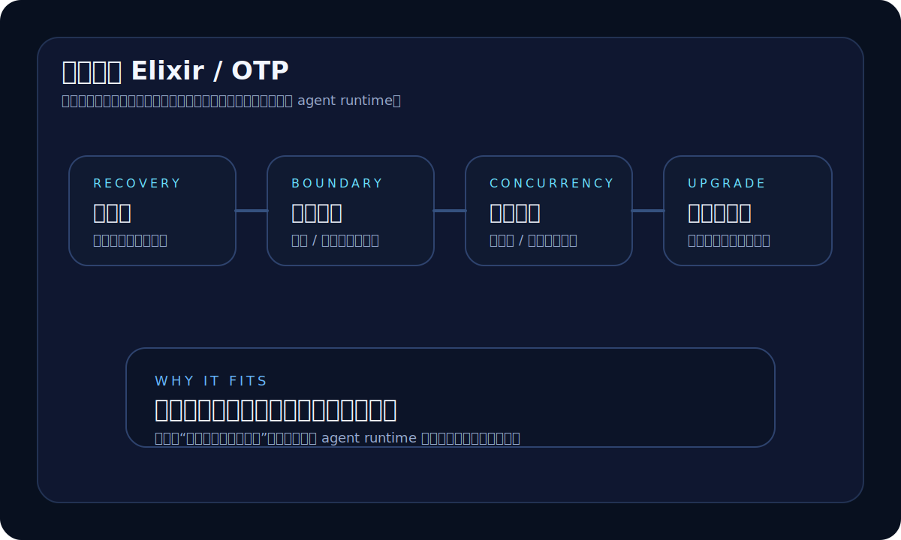
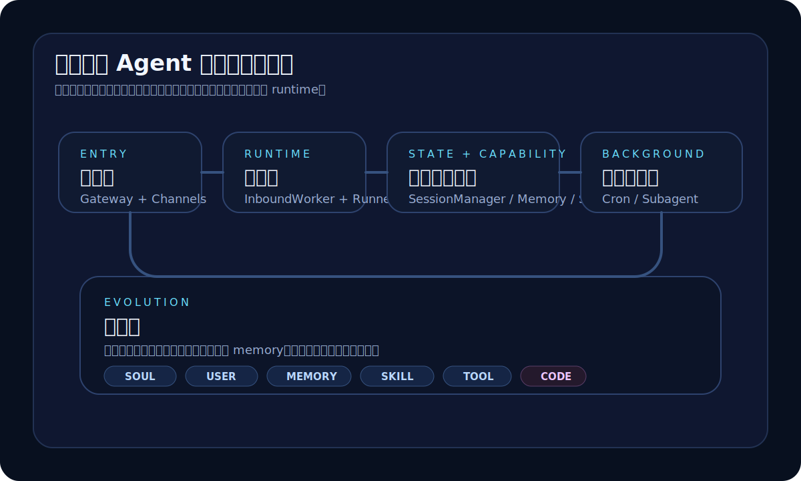
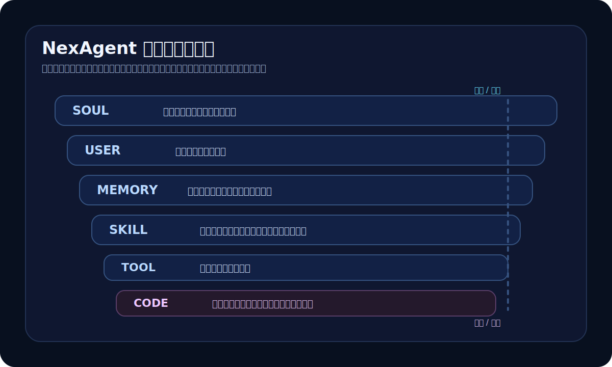
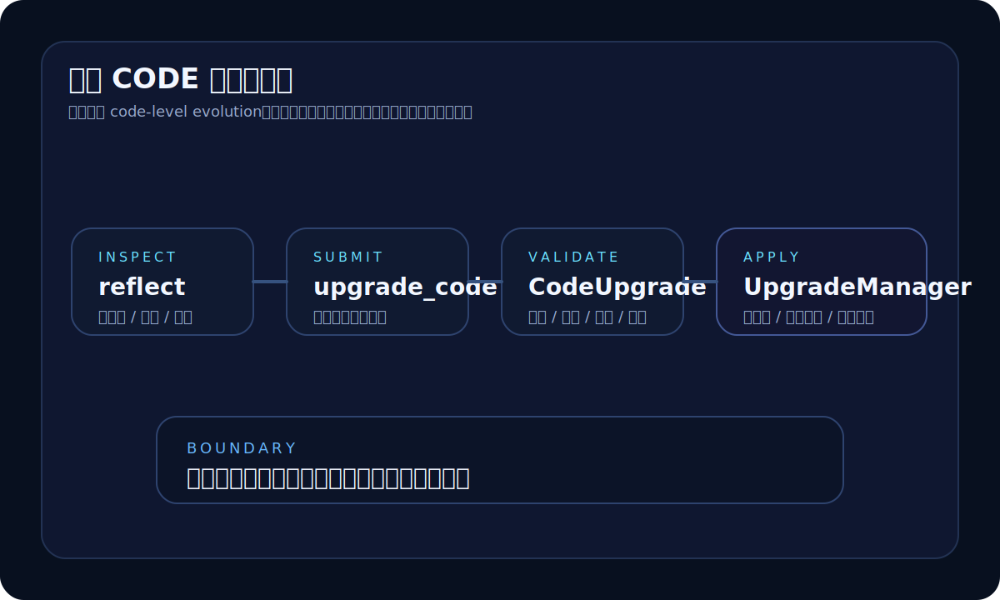

  

    

    

    
gofenix / NexAgent

    <h1 class="nx-title mt-6 !text-7xl !font-semibold">NexAgent</h1>
    

      从“养龙虾”到
       
      长期运行的 Agent 系统
    

    

      

        为什么在 OpenClaw 之后，
        我们还要再做一个自己的 agent？
      

      

        这次分享关心的不是“再做一个 demo”，而是 agent 如何作为一个系统继续存在。
      

    

  

  

    
  

---
layout: center
---

  
Question

  <h1 class="nx-title mt-8 !text-[4.2rem] !leading-[1.06] !font-semibold">
    既然已经有了 OpenClaw，
     
    为什么还要再做一个
    NexAgent？
  </h1>

---

  

    
OpenClaw 打开的门

    
Agent 已经开始像“系统”

    <ul class="mt-6 space-y-3 text-xl leading-relaxed nx-muted">
      <li>会写代码</li>
      <li>会串流程</li>
      <li>会调用工具</li>
      <li>会长出意料之外的能力</li>
    </ul>
    

      以前更像预制软件。现在开始出现“现场组合能力”的迹象。
    

  

  

    
真正的问题在后面

    
如果它要长期存在，该怎么活着？

    <ul class="mt-6 space-y-3 text-xl leading-relaxed nx-muted">
      <li>怎么长期在线</li>
      <li>怎么进入真实聊天环境</li>
      <li>怎么组织会话和记忆</li>
      <li>学到的新东西放在哪里</li>
      <li>未来怎么稳定地继续长</li>
    </ul>
  

---
layout: center
---

  
Shift

  
问题已经从

  
“怎么做一个 agent demo”

  
变成了

  
“怎么做一个长期运行的 agent 系统”

---

  

    
为什么要自己做

    

      自己做一个 agent 的意义，
       
      在于真正从使用者切换到创造者。
    

  

  

    

      
1. 你会真正区分 prompt 问题和系统问题

    

    

      
2. 你会亲手踩到多通道、会话、记忆、调度这些坑

    

    

      
3. 你会被迫回答：这个 agent 的底层结构到底应该是什么

    

  

---
layout: center
---

  
Position

  

    NexAgent 的出发点，
    是把“养龙虾”带来的直觉继续往系统设计的方向推进一步。
  

---

# 继续追问

  

    
真正把问题逼出来的

    

      不是“再做一个 demo”，
       
      而是下面这三个问题。
    

  

  

    

      
1. 记忆到底是什么？

      
有价值的往往不是“记得我是谁”，而是“记得我是怎么做事的”。

    

    

      
2. agent 的主动性从哪里来？

      
很多时候不是玄学规划，而是调度、定时器和后台执行结构。

    

    

      
3. 新学到的东西该放在哪里？

      
如果最后都堆进 prompt 或 memory，系统很快就会糊成一团。

    

  

---
layout: center
---

  
Part 1

  <h1 class="nx-title mt-8 !text-7xl">为什么是 Elixir / OTP</h1>

---

  

    
如果只是单轮执行器

    <ul class="mt-6 space-y-3 text-xl nx-muted">
      <li>调一次模型</li>
      <li>做几次 tool calling</li>
      <li>返回一个结果</li>
    </ul>
    
技术选型空间很大。

  

  

    
如果是长期在线系统

    <ul class="mt-6 space-y-3 text-xl">
      <li>多聊天通道接入</li>
      <li>多会话并行</li>
      <li>后台任务和定时任务</li>
      <li>失败恢复</li>
      <li>热更新</li>
      <li>未来可能还有自我升级</li>
    </ul>
    
运行时能力会直接变成产品能力。

  

---

  

---
layout: center
---

  
Part 2

  <h1 class="nx-title mt-8 !text-7xl">NexAgent 里面到底有什么</h1>

---

  

---

  

    

      
入口层

      
Gateway + Channels

      
让 agent 真正接住持续流动的消息流。

    

    

      
运行层

      
InboundWorker + Runner

      
把消息、安全调度、tool calling 和 agent loop 组织成稳定过程。

    

  

  

    

      
状态与能力层

      

        SessionManager / Memory
         
        Tool.Registry / Skills
      

      
让系统具备长期会话、长期事实、方法沉淀和能力扩展。

    

    

      
后台执行层

      
Cron / Subagent

      
让系统获得主动执行和后台拆分执行能力。

    

  

---

# 核心模块

  

    
入口

    
Gateway

    
统一编排聊天入口。

  

  

    
调度中枢

    
Runner

    
上下文、LLM loop、tool calling 的中枢。

  

  

    
入口到运行

    
InboundWorker

    
消息路由、会话调度、排队。

  

  

    
长期状态

    
Memory

    
把用户信息和环境事实分层保存。

  

  

    
能力扩展

    
Tool.Registry / Skills

    
把能力和方法拆开，避免堆成一团。

  

  

    
升级路径

    
CodeUpgrade / UpgradeManager

    
给 code-level evolution 一条受控路径。

  

---
layout: center
---

  
Part 3

  <h1 class="nx-title mt-8 !text-7xl">进化如果不分层，系统很快就会变形</h1>

---

  

    
错误路径

    
所有变化都堆在一起

    <ul class="mt-6 space-y-3 text-xl text-[#f0c7d3]">
      <li>今天改一点 prompt</li>
      <li>明天记一条 memory</li>
      <li>后天补一个脚本</li>
      <li>接着再塞一个工具</li>
    </ul>
    
结果：难判断、难复用、难升级。

  

  

    
正确路径

    
先决定变化该落在哪一层

    <ul class="mt-6 space-y-3 text-xl">
      <li>事实进入 `USER / MEMORY`</li>
      <li>方法沉淀成 `SKILL`</li>
      <li>稳定能力升级成 `TOOL`</li>
      <li>只有最后才进入 `CODE`</li>
    </ul>
    
系统会保持可理解、可迭代。

  

---

  

---

# 分流原则

  

    
优先级

    

      变化优先落在
      更轻、更高
      的层。
    

  

  

    

      

        1. 能进入 USER / MEMORY，就先不要急着写 SKILL
      

    

    

      

        2. 能沉淀成 SKILL，就先不要急着做 TOOL
      

    

    

      

        3. 能做成 TOOL，就先不要急着改 CODE
      

    

  

---

  

---
layout: center
---

  
Part 4

  <h1 class="nx-title mt-8 !text-7xl">为什么这件事值得做</h1>

---

# 我们真正关心的

  

Agent 能不能从一个好用的 demo，变成一个长期在线的系统？

  

Agent 能不能真正进入聊天环境，成为日常工作流的一部分？

  

Agent 能不能不只记住标签和片段，而是逐渐学会方法、沉淀方法、复用方法？

  

Agent 的能力扩展，能不能有一个不会越来越乱的结构？

---
layout: center
---

  
Conclusion

  

    未来更有价值的，不是一个平均意义上“什么都会一点”的 agent。
  

  

    

      更有价值的，
       
      是一个专属系统。
    

    

      
它能够理解具体用户。

      
它服务具体工作流。

      

        它在真实环境里持续进化。
      

    

  

---
layout: center
---

  
Closing

  <h1 class="nx-title mt-8 !text-6xl">NexAgent</h1>
  

    它未必已经给出最终答案。
     
    但它在认真把这些问题落到一个
    真实可运行的系统 里。
  

  
github.com/gofenix/nex-agent

